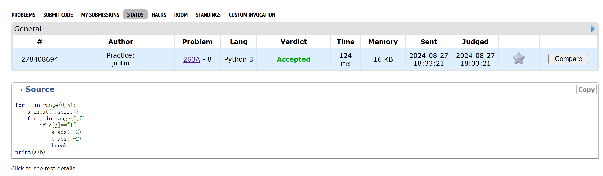
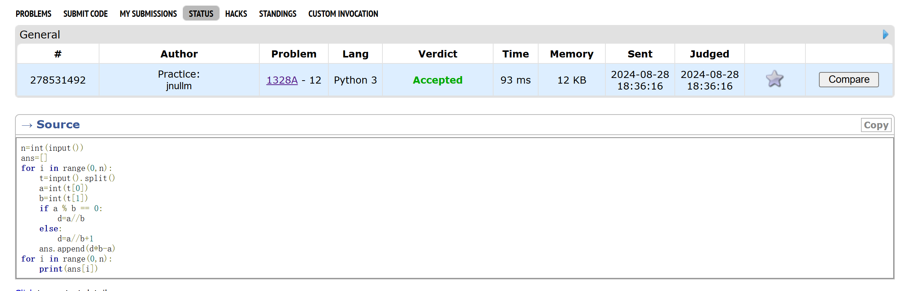
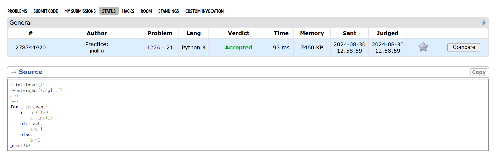
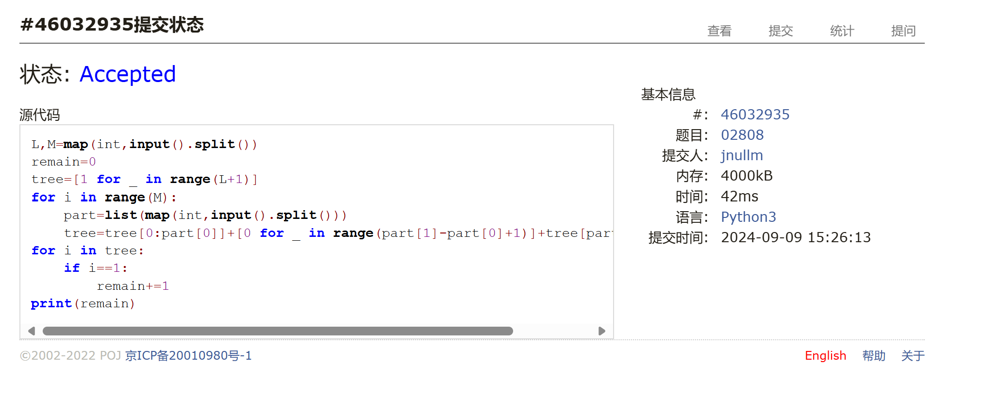
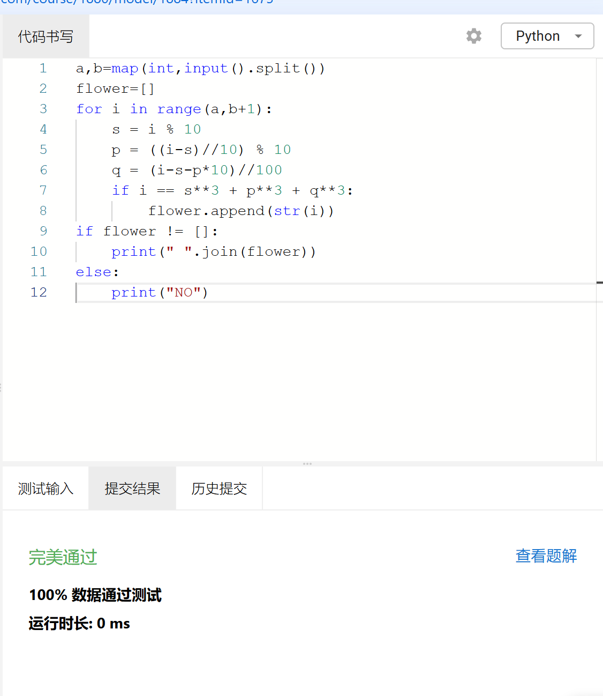
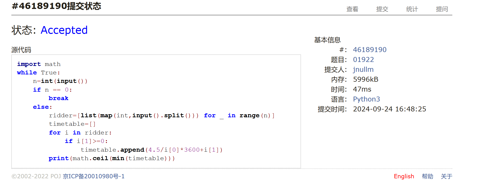

# Assignment #2: 语法练习

Updated 0126 GMT+8 Sep 24, 2024

2024 fall, Complied by ==金俊毅、物理学院

## 1. 题目

### 263A. Beautiful Matrix

https://codeforces.com/problemset/problem/263/A

##### 代码

```python
for i in range(0,5):
    s=input().split()
    for j in range(0,5):
        if s[j]=="1":
            a=abs(i-2)
            b=abs(j-2)
            break
print(a+b)

```

代码运行截图 ==（至少包含有"Accepted"）==



### 1328A. Divisibility Problem

https://codeforces.com/problemset/problem/1328/A

##### 代码

```python
n=int(input())
ans=[]
for i in range(0,n):
    t=input().split()
    a=int(t[0])
    b=int(t[1])
    if a % b == 0:
        d=a//b
    else:
        d=a//b+1
    ans.append(d*b-a)
for i in range(0,n):
    print(ans[i])

```

代码运行截图 ==（至少包含有"Accepted"）==



### 427A. Police Recruits

https://codeforces.com/problemset/problem/427/A

##### 代码

```python
n=int(input())
event=input().split()
a=0
b=0
for i in event:
    if int(i)>0:
        a+=int(i)
    elif a>0:
        a=a-1
    else:
        b+=1
print(b)

```

代码运行截图 ==（AC代码截图，至少包含有"Accepted"）==



### 02808: 校门外的树

http://cs101.openjudge.cn/practice/02808/

##### 代码

```python
L,M=map(int,input().split())
remain=0
tree=[1 for _ in range(L+1)]
for i in range(M):
    part=list(map(int,input().split()))
    tree=tree[0:part[0]]+[0 for _ in range(part[1]-part[0]+1)]+tree[part[1]+1:L+1]
for i in tree:
    if i==1:
        remain+=1
print(remain)

```

代码运行截图 ==（AC代码截图，至少包含有"Accepted"）==



### sy60: 水仙花数II

https://sunnywhy.com/sfbj/3/1/60

##### 代码

```python
a,b=map(int,input().split())
flower=[]
for i in range(a,b+1):
    s = i % 10
    p = ((i-s)//10) % 10
    q = (i-s-p*10)//100
    if i == s**3 + p**3 + q**3:
        flower.append(str(i))
if flower != []:
    print(" ".join(flower))
else:
    print("NO")

```

代码运行截图 ==（AC代码截图，至少包含有"Accepted"）==



### 01922: Ride to School

http://cs101.openjudge.cn/practice/01922/

##### 代码

```python
import math
while True:
    n=int(input())
    if n == 0:
        break
    else:
        ridder=[list(map(int,input().split())) for _ in range(n)]
        timetable=[]
        for i in ridder:
            if i[1]>=0:
                timetable.append(4.5/i[0]*3600+i[1])
        print(math.ceil(min(timetable))) 

```

代码运行截图 ==（AC代码截图，至少包含有"Accepted"）==



## 2. 学习总结和收获

每日选做仍然在每天跟着做，但明显感觉这两天的题变难了，还是要多学习一些优秀的解题思路


