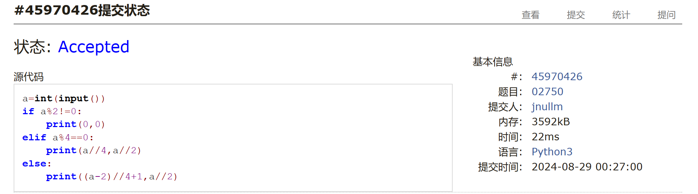
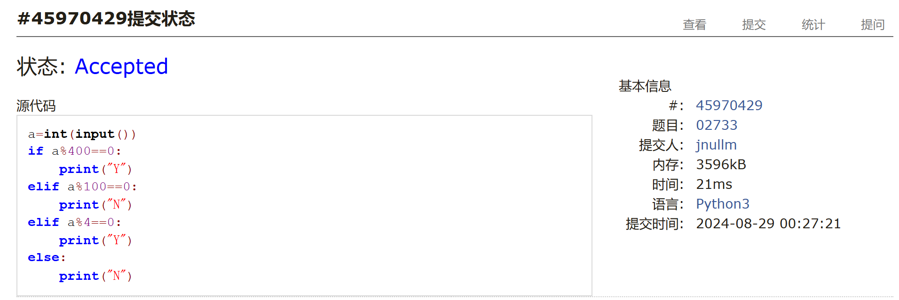
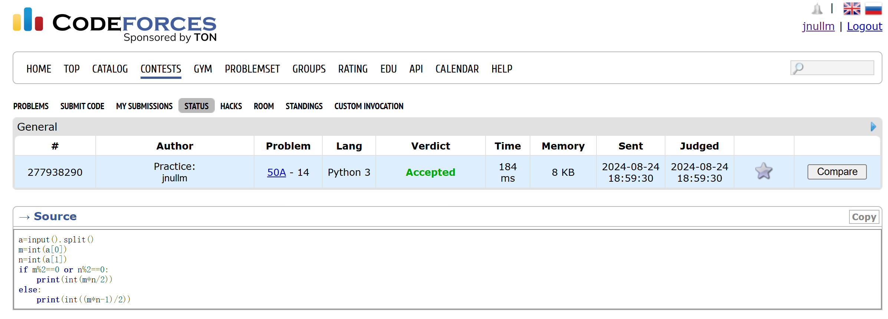
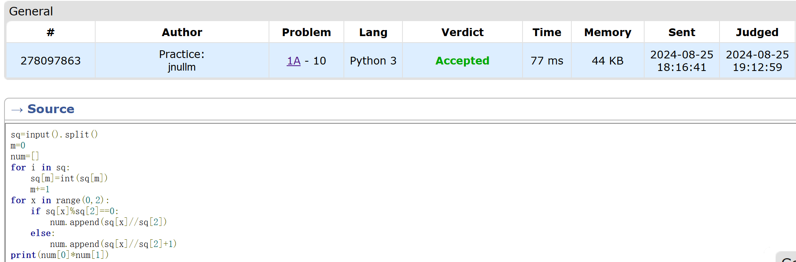
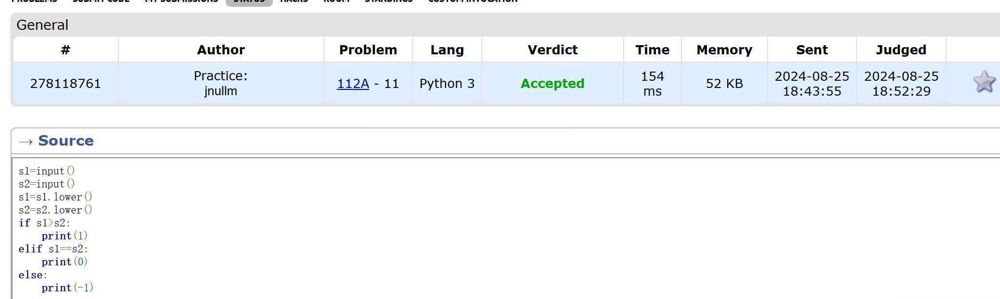
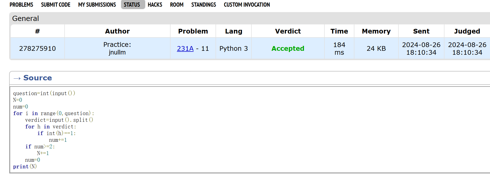

# Assignment #1: 自主学习

2024 fall, Complied by 金俊毅、物理学院24级


## 1. 题目

### 02733: 判断闰年

http://cs101.openjudge.cn/practice/02733/

##### 代码

```python
a=int(input())
if a%400==0:
    print("Y")
elif a%100==0:
    print("N")
elif a%4==0:
    print("Y")
else:
    print("N")

```




### 02750: 鸡兔同笼

http://cs101.openjudge.cn/practice/02750/


##### 代码

```python
a=int(input())
if a%2!=0:
    print(0,0)
elif a%4==0:
    print(a//4,a//2)
else:
    print((a-2)//4+1,a//2)

```




### 50A. Domino piling

greedy, math, 800, http://codeforces.com/problemset/problem/50/A


##### 代码

```python
a=input().split()
m=int(a[0])
n=int(a[1])
if m%2==0 or n%2==0:
    print(int(m*n/2))
else:
    print(int((m*n-1)/2))

```




### 1A. Theatre Square

math, 1000, https://codeforces.com/problemset/problem/1/A


##### 代码

```python
sq=input().split()
m=0
num=[]
for i in sq:
    sq[m]=int(sq[m])
    m+=1
for x in range(0,2):
    if sq[x]%sq[2]==0:
        num.append(sq[x]//sq[2])
    else:
        num.append(sq[x]//sq[2]+1)
print(num[0]*num[1])

```



### 112A. Petya and Strings

implementation, strings, 1000, http://codeforces.com/problemset/problem/112/A


##### 代码

```python
s1=input()
s2=input()
s1=s1.lower()
s2=s2.lower()
m=0
for i in range(0,len(s1)):
    m+=1
    if s1[i]<s2[i]:
        print(-1)
        break
    if s1[i]>s2[i]:
        print(1)
        break
    if m==len(s1) and s1[len(s1)-1]==s2[len(s2)-1]:
        print(0)

```




### 231A. Team

bruteforce, greedy, 800, http://codeforces.com/problemset/problem/231/A


##### 代码

```python
question=int(input())
N=0
num=0
for i in range(0,question):
    verdict=input().split()
    for h in verdict:
        if int(h)==1:
            num+=1
    if num>=2:
        N+=1
    num=0
print(N)

```




## 2. 学习总结和收获

目前做题思路仍然比较僵硬，还不够灵活，尽管每日选做的题都比较容易做出来，但在每一次做完题，然后跟答案的代码比较的时候，总能学到一些新奇的思路和没见过的函数