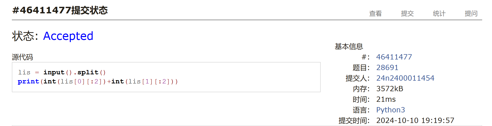

# Assign #3: Oct Mock Exam暨选做题目满百

Updated 1537 GMT+8 Oct 12, 2024

2024 fall, Complied by 金俊毅，物理学院
、
## 1. 题目

### E28674:《黑神话：悟空》之加密

http://cs101.openjudge.cn/practice/28674/

代码

```python
k = int(input())
s = input()
ans = ""
for i in s:
    if 97 <= ord(i) <= 122:
        ans += chr(122 - ((122 - ord(i) + (k%26))%26))
    else:
        ans += chr(90 - ((90 - ord(i) + (k%26))%26))
print(ans)
```


代码运行截图 ==（至少包含有"Accepted"）==


### E28691: 字符串中的整数求和

http://cs101.openjudge.cn/practice/28691/


代码

```python
lis = input().split()
print(int(lis[0][:2])+int(lis[1][:2]))
```


代码运行截图 ==（至少包含有"Accepted"）==





### M28664: 验证身份证号

http://cs101.openjudge.cn/practice/28664/

代码

```python
n = int(input())
number = [7,9,10,5,8,4,2,1,6,3,7,9,10,5,8,4,2]
check = [1,0,"X",9,8,7,6,5,4,3,2]
for _ in range(n):
    sum_num = 0
    s = input()
    for j in range(17):
        sum_num += number[j]*int(s[j])
    if str(check[sum_num % 11]) == s[-1]:
        print("YES")
    else:
        print("NO")
```


代码运行截图 ==（AC代码截图，至少包含有"Accepted"）==


### M28678: 角谷猜想

http://cs101.openjudge.cn/practice/28678/


代码

```python
n = int(input())
while n != 1:
    if n % 2 != 0:
        print(str(n) + "*3+1=" + str(3 * n + 1))
        n = 3*n + 1
    else:
        print(str(n)+"/2="+str(n//2))
        n = n // 2
print("End")
```


代码运行截图 ==（AC代码截图，至少包含有"Accepted"）==


### M28700: 罗马数字与整数的转换

http://cs101.openjudge.cn/practice/28700/


##### 代码

```python
rom_to_num = {
    'I': 1, 'IV': 4, 'V': 5, 'IX': 9,
    'X': 10, 'XL': 40, 'L': 50, 'XC': 90,
    'C': 100, 'CD': 400, 'D': 500, 'CM': 900,
    'M': 1000
}

num_to_rom = {
    1000: 'M', 900: 'CM', 500: 'D', 400: 'CD',
    100: 'C', 90: 'XC', 50: 'L', 40: 'XL',
    10: 'X', 9: 'IX', 5: 'V', 4: 'IV', 1: 'I'
}
def to_num(s):
    i = 0
    num = 0
    while i < len(s):
        if i+1 <len(s) and s[i:i+2] in rom_to_num:
            num += rom_to_num[s[i:i+2]]
            i += 2
        else:
            num += rom_to_num[s[i]]
            i += 1
    return num

def to_rom(n):
    srom = ""
    for j in num_to_rom:
        while n >= j:
            if n >= j:
                srom += num_to_rom[j]
                n -= j
    return srom

inin = input()
if 65 <= ord(inin[0]) <= 90:
    print(to_num(inin))
else:
    print(to_rom(int(inin)))
```


代码运行截图 ==（AC代码截图，至少包含有"Accepted"）==


### *T25353: 排队 （选做）

http://cs101.openjudge.cn/practice/25353/


代码

```python
n, d = map(int, input().split())
height = [int(input()) for _ in range(n)]
i = 0
while i < n-1:
    min_hei = height[i]
    max_hei = height[i]
    next = height[i:i+1]
    change = []
    j = i + 1
    ori = j
    arbit = 0
    judge = 0
    while height[i] + d >= height[j] >= height[i] - 2*d:
        if height[j] > max_hei:
            max_hei = height[j]
        if height[j] < min_hei:
            min_hei = height[j]
        if height[i] - d <= height[j] <= height[i] and abs(min_hei - height[j]) <= d and abs(
            max_hei - height[j]) <= d:
            judge = 1
            change.append(height[j])
            if j == n-1:
                arbit = 1
            next += height[ori:j]
            ori = j + 1
        if j == n-1:
            break
        j += 1
    change.sort()
    if judge == 1:
        if arbit == 0:
            height = height[:i] + change + next + height[ori:]
        else:
            height = height[:i] + change + next
    i += 1 + len(change)

for k in height:
    print(k)
```


代码运行截图 ==（AC代码截图，至少包含有"Accepted"）==


## 2. 学习总结和收获

最近在看算法基础与在线实践，跟着一道道例题去做，上面的例题对我来说确实难，只好慢慢啃，但也学到了不少有趣的思想。因为这本书比较难啃，所以这几天我舍弃了每日选做，打算等我把这本书看差不多在回头处理积攒的题目。
这几天的投入时间大概就是其他的作业写完了就都在学算法，平均下来每日3h+应该有。
在算法还是要多琢磨一下，今天用了大概两小时只凭自己思考把排队的算法优化了一下，虽然比用时比最快的还多了一个量级，但起码比最开始超时小了一个量级，也算是一点小进步吧。这两天在自己思考一下，实在想不出来再去看看别人怎么写的。
遗憾的是，月考上机因为感冒了没有参加，后面自己稍微掐了一下表，AC5应该没问题，最后一题应该会写出超时的代码。


