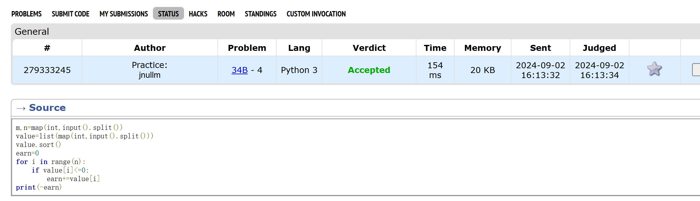
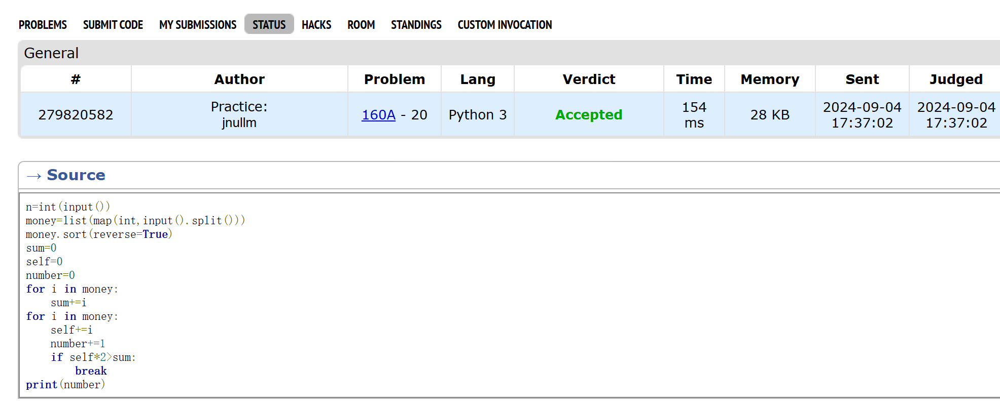
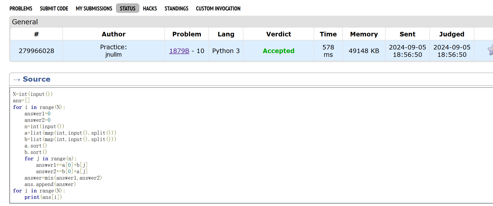
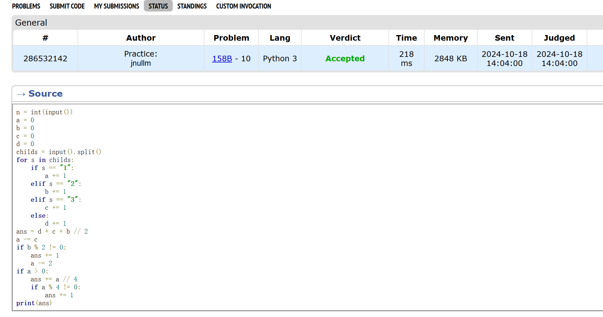
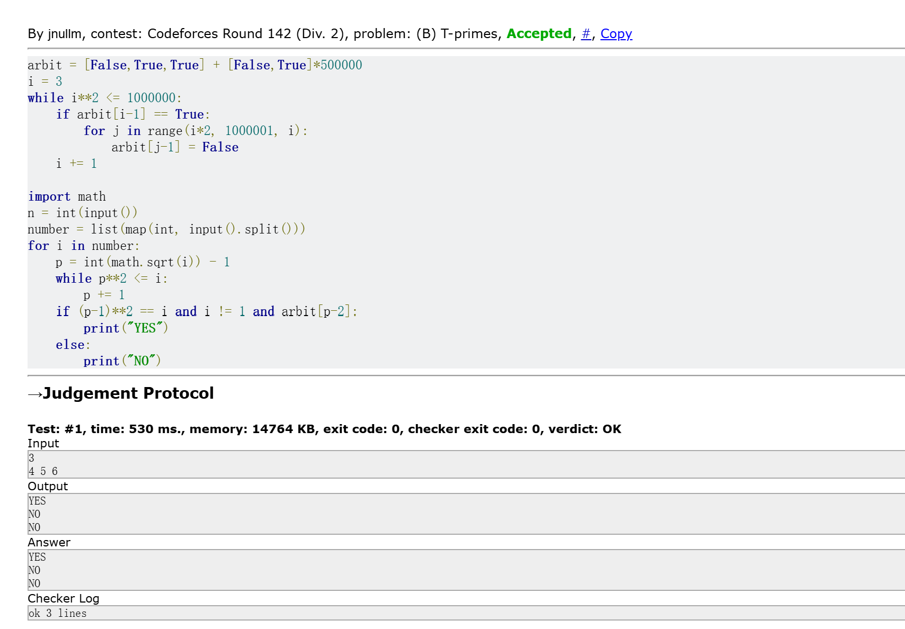
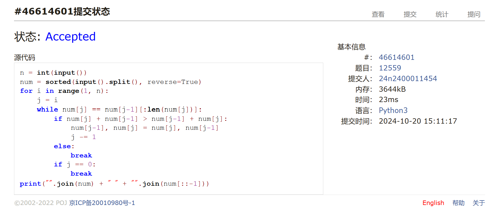

# Assignment #4: T-primes + 贪心

Updated 0337 GMT+8 Oct 15, 2024

2024 fall, Complied by 金俊毅 物理学院


## 1. 题目

### 34B. Sale

greedy, sorting, 900, https://codeforces.com/problemset/problem/34/B

代码

```python
m,n=map(int,input().split())
value=list(map(int,input().split()))
value.sort()
earn=0
for i in range(n):
    if value[i]<=0:
        earn+=value[i]
print(-earn)

```
代码运行截图 <mark>（至少包含有"Accepted"）</mark>




### 160A. Twins

greedy, sortings, 900, https://codeforces.com/problemset/problem/160/A

代码

```python
n=int(input())
money=list(map(int,input().split()))
money.sort(reverse=True)
sum=0
self=0
number=0
for i in money:
    sum+=i
for i in money:
    self+=i
    number+=1
    if self*2>sum:
        break
print(number)
```


代码运行截图 ==（至少包含有"Accepted"）==



### 1879B. Chips on the Board

constructive algorithms, greedy, 900, https://codeforces.com/problemset/problem/1879/B

代码

```python
N=int(input())
ans=[]
for i in range(N):
    answer1=0
    answer2=0
    n=int(input())
    a=list(map(int,input().split()))
    b=list(map(int,input().split()))
    a.sort()
    b.sort()
    for j in range(n):
        answer1+=a[0]+b[j]
        answer2+=b[0]+a[j]
    answer=min(answer1,answer2)
    ans.append(answer)
for i in range(N):
    print(ans[i])

```


代码运行截图 <mark>（至少包含有"Accepted"）</mark>




### 158B. Taxi

*special problem, greedy, implementation, 1100, https://codeforces.com/problemset/problem/158/B


代码

```python
n = int(input())
a = 0
b = 0
c = 0
d = 0
childs = input().split()
for s in childs:
    if s == "1":
        a += 1
    elif s == "2":
        b += 1
    elif s == "3":
        c += 1
    else:
        d += 1
ans = d + c + b // 2
a -= c
if b % 2 != 0:
    ans += 1
    a -= 2
if a > 0:
    ans += a // 4
    if a % 4 != 0:
        ans += 1
print(ans)
```


代码运行截图 <mark>（至少包含有"Accepted"）</mark>




### *230B. T-primes（选做）

binary search, implementation, math, number theory, 1300, http://codeforces.com/problemset/problem/230/B

代码

```python
arbit = [False,True,True] + [False,True]*500000
i = 3
while i**2 <= 1000000:
    if arbit[i-1] == True:
        for j in range(i*2, 1000001, i):
            arbit[j-1] = False
    i += 1
 
import math
n = int(input())
number = list(map(int, input().split()))
for i in number:
    p = int(math.sqrt(i)) - 1
    while p**2 <= i:
        p += 1
    if (p-1)**2 == i and i != 1 and arbit[p-2]:
        print("YES")
    else:
        print("NO")

```


代码运行截图 <mark>（至少包含有"Accepted"）</mark>




### *12559: 最大最小整数 （选做）

greedy, strings, sortings, http://cs101.openjudge.cn/practice/12559

代码

```python
n = int(input())
num = sorted(input().split(), reverse=True)
for i in range(1, n):
    j = i
    while num[j] == num[j-1][:len(num[j])]:
        if num[j] + num[j-1] > num[j-1] + num[j]:
            num[j-1], num[j] = num[j], num[j-1]
            j -= 1
        else:
            break
        if j == 0:
            break
print("".join(num) + " " + "".join(num[::-1]))
```


代码运行截图 <mark>（至少包含有"Accepted"）</mark>




## 2. 学习总结和收获
本周是继续看《算法基础与在线实践》，把上面每一章都看了一遍，各个章节都做了一些题目，于是就回来从之前因为看书断开的进度，开始回头赶每日选做了。看算法书前觉得很难的题目，现在会比较容易地想到思路，仍然是有进步的。

这周学的时间比较诡异，周一到周四课余时间一直在写其他课程的论文，从周五下午开始才开始写计概作业。因为前几天都没写，于是周五晚上和周六日整天都在学，合计也应该有20小时。


