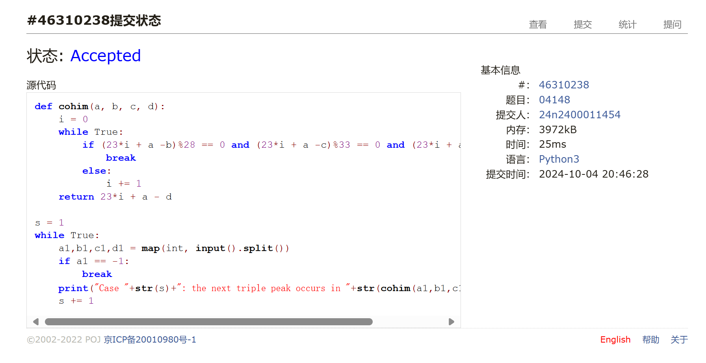
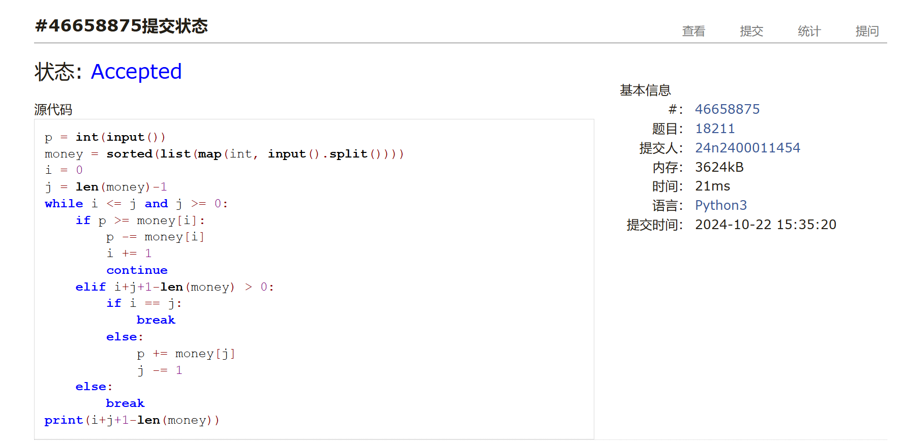
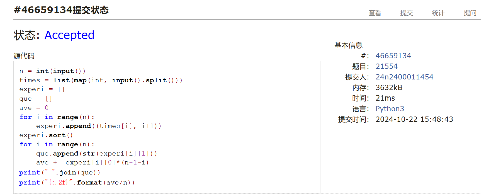
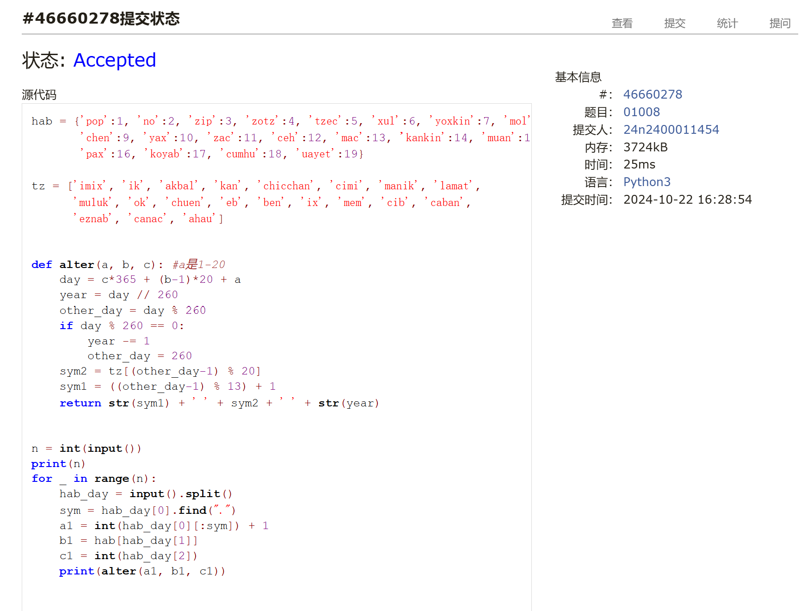
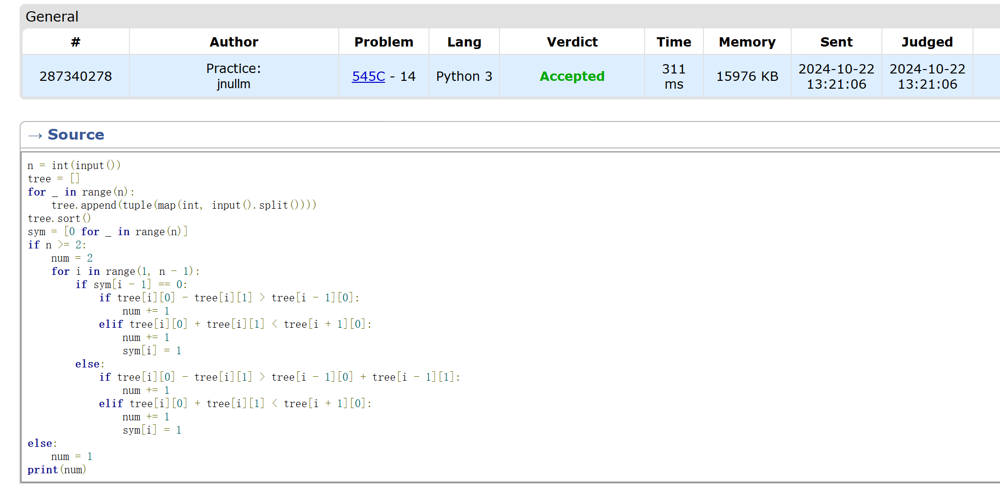
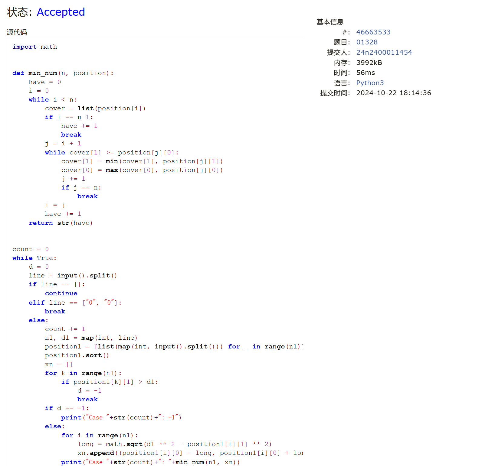

# Assignment #5: Greedy穷举Implementation

Updated 1939 GMT+8 Oct 21, 2024

2024 fall, Complied by 金俊毅，物理学院

## 1. 题目

### 04148: 生理周期

brute force, http://cs101.openjudge.cn/practice/04148

代码：

```python
def cohim(a, b, c, d):
    i = 0
    while True:
        if (23*i + a -b)%28 == 0 and (23*i + a -c)%33 == 0 and (23*i + a - d) > 0:
            break
        else:
            i += 1
    return 23*i + a - d

s = 1
while True:
    a1,b1,c1,d1 = map(int, input().split())
    if a1 == -1:
        break
    print("Case "+str(s)+": the next triple peak occurs in "+str(cohim(a1,b1,c1,d1))+" days.")
    s += 1
```

代码运行截图 <mark>（至少包含有"Accepted"）</mark>



### 18211: 军备竞赛

greedy, two pointers, http://cs101.openjudge.cn/practice/18211


代码：

```python
p = int(input())
money = sorted(list(map(int, input().split())))
i = 0
j = len(money)-1
while i <= j and j >= 0:
    if p >= money[i]:
        p -= money[i]
        i += 1
        continue
    elif i+j+1-len(money) > 0:
        if i == j:
            break
        else:
            p += money[j]
            j -= 1
    else:
        break
print(i+j+1-len(money))
```

代码运行截图 ==（至少包含有"Accepted"）==



### 21554: 排队做实验

greedy, http://cs101.openjudge.cn/practice/21554

代码：

```python
n = int(input())
times = list(map(int, input().split()))
experi = []
que = []
ave = 0
for i in range(n):
    experi.append((times[i], i+1))
experi.sort()
for i in range(n):
    que.append(str(experi[i][1]))
    ave += experi[i][0]*(n-1-i)
print(" ".join(que))
print("{:.2f}".format(ave/n))
```


代码运行截图 <mark>（至少包含有"Accepted"）</mark>



### 01008: Maya Calendar

implementation, http://cs101.openjudge.cn/practice/01008/


代码：

```python
hab = {'pop':1, 'no':2, 'zip':3, 'zotz':4, 'tzec':5, 'xul':6, 'yoxkin':7, 'mol':8,
       'chen':9, 'yax':10, 'zac':11, 'ceh':12, 'mac':13, 'kankin':14, 'muan':15,
       'pax':16, 'koyab':17, 'cumhu':18, 'uayet':19}

tz = ['imix', 'ik', 'akbal', 'kan', 'chicchan', 'cimi', 'manik', 'lamat',
      'muluk', 'ok', 'chuen', 'eb', 'ben', 'ix', 'mem', 'cib', 'caban',
      'eznab', 'canac', 'ahau']


def alter(a, b, c): #a是1-20
    day = c*365 + (b-1)*20 + a
    year = day // 260
    other_day = day % 260
    if day % 260 == 0:
        year -= 1
        other_day = 260
    sym2 = tz[(other_day-1) % 20]
    sym1 = ((other_day-1) % 13) + 1
    return str(sym1) + ' ' + sym2 + ' ' + str(year)


n = int(input())
print(n)
for _ in range(n):
    hab_day = input().split()
    sym = hab_day[0].find(".")
    a1 = int(hab_day[0][:sym]) + 1
    b1 = hab[hab_day[1]]
    c1 = int(hab_day[2])
    print(alter(a1, b1, c1))
```


代码运行截图 <mark>（至少包含有"Accepted"）</mark>



### 545C. Woodcutters

dp, greedy, 1500, https://codeforces.com/problemset/problem/545/C

代码：

```python
n = int(input())
tree = []
for _ in range(n):
    tree.append(tuple(map(int, input().split())))
tree.sort()
sym = [0 for _ in range(n)]
if n >= 2:
    num = 2
    for i in range(1, n - 1):
        if sym[i - 1] == 0:
            if tree[i][0] - tree[i][1] > tree[i - 1][0]:
                num += 1
            elif tree[i][0] + tree[i][1] < tree[i + 1][0]:
                num += 1
                sym[i] = 1
        else:
            if tree[i][0] - tree[i][1] > tree[i - 1][0] + tree[i - 1][1]:
                num += 1
            elif tree[i][0] + tree[i][1] < tree[i + 1][0]:
                num += 1
                sym[i] = 1
else:
    num = 1
print(num)
```


代码运行截图 <mark>（至少包含有"Accepted"）</mark>



### 01328: Radar Installation

greedy, http://cs101.openjudge.cn/practice/01328/

思路：


代码：

```python
import math


def min_num(n, position):
    have = 0
    i = 0
    while i < n:
        cover = list(position[i])
        if i == n-1:
            have += 1
            break
        j = i + 1
        while cover[1] >= position[j][0]:
            cover[1] = min(cover[1], position[j][1])
            cover[0] = max(cover[0], position[j][0])
            j += 1
            if j == n:
                break
        i = j
        have += 1
    return str(have)


count = 0
while True:
    d = 0
    line = input().split()
    if line == []:
        continue
    elif line == ["0", "0"]:
        break
    else:
        count += 1
        n1, d1 = map(int, line)
        position1 = [list(map(int, input().split())) for _ in range(n1)]
        position1.sort()
        xn = []
        for k in range(n1):
            if position1[k][1] > d1:
                d = -1
                break
        if d == -1:
            print("Case "+str(count)+": -1")
        else:
            for i in range(n1):
                long = math.sqrt(d1 ** 2 - position1[i][1] ** 2)
                xn.append((position1[i][0] - long, position1[i][0] + long))
            print("Case "+str(count)+": "+min_num(n1, xn))
```

代码运行截图 <mark>（至少包含有"Accepted"）</mark>



## 2. 学习总结和收获

因为看算法书耽误的二十多天每日选做这两天已经基本赶回来了，还差四五题，多写写题一点点进步吧。


