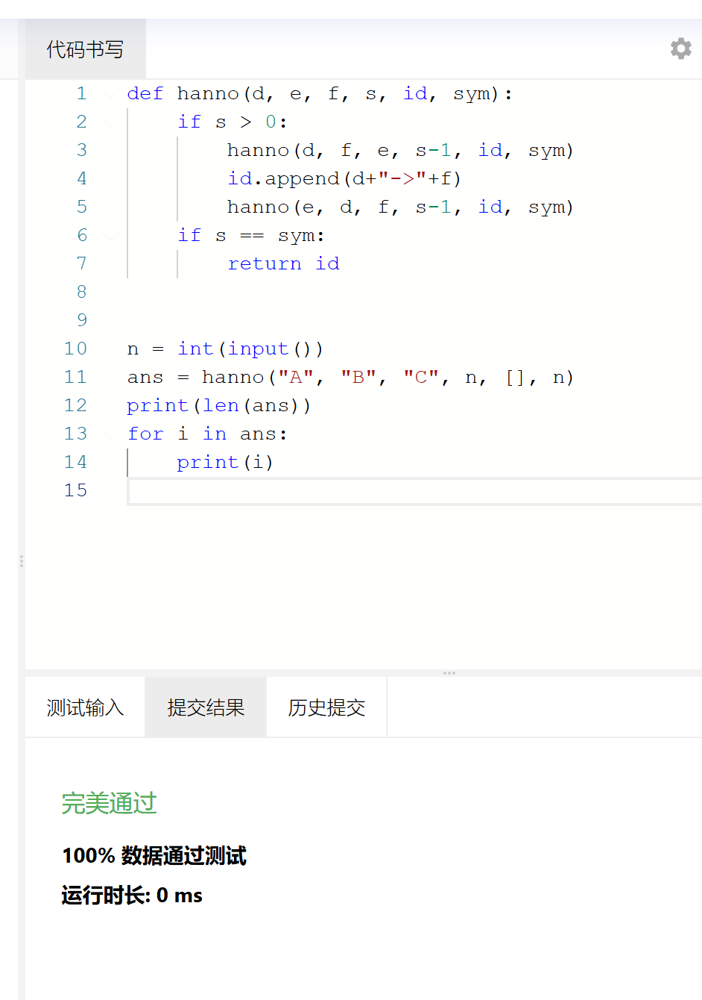
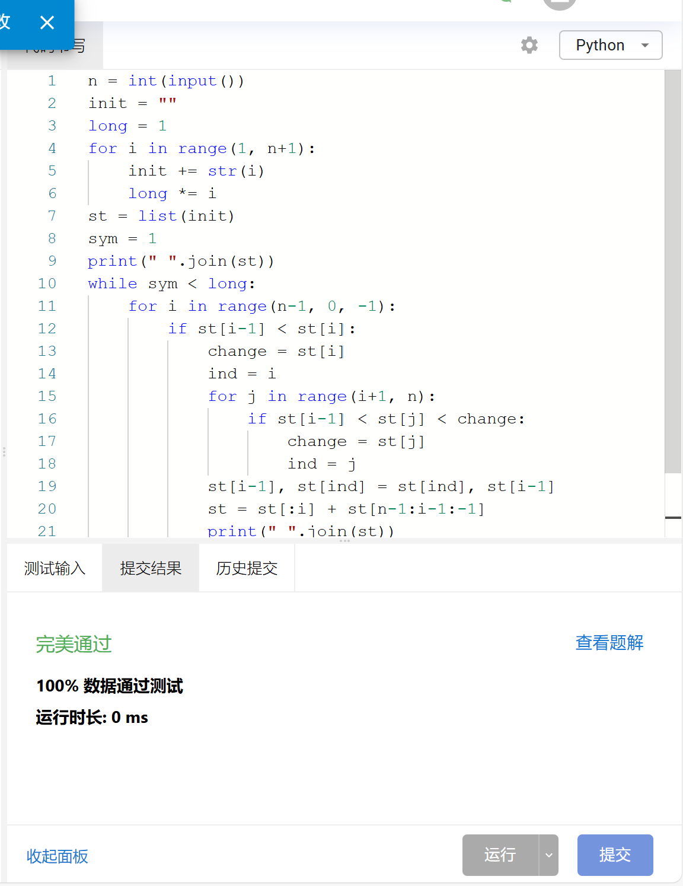
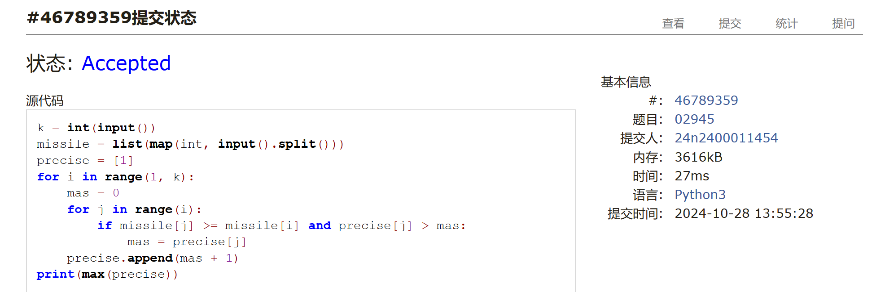
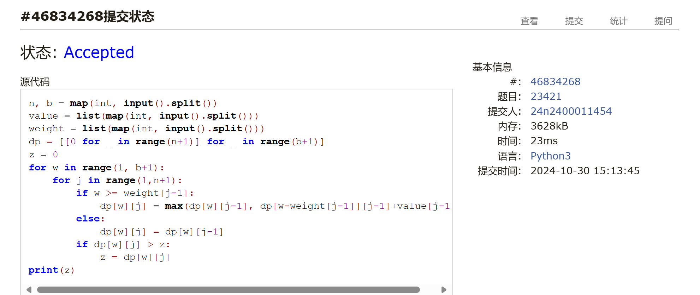
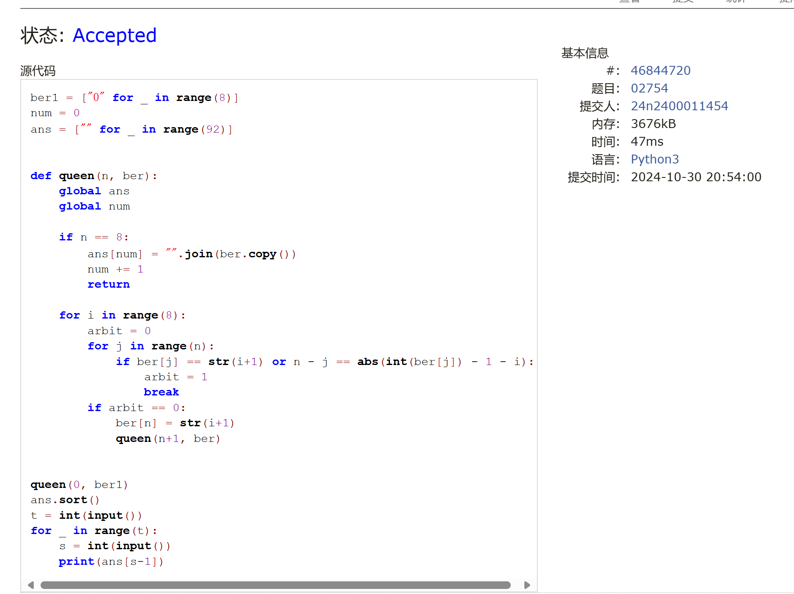
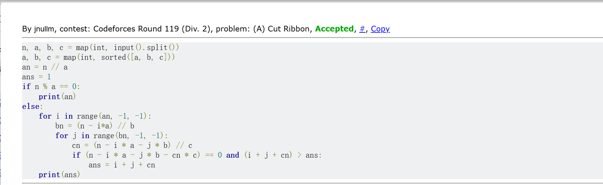

# Assignment #6: Recursion and DP

Updated 2201 GMT+8 Oct 29, 2024

2024 fall, Complied by 金俊毅，物理学院


**说明：**

1）请把每个题目解题思路（可选），源码Python, 或者C++（已经在Codeforces/Openjudge上AC），截图（包含Accepted），填写到下面作业模版中（推荐使用 typora https://typoraio.cn ，或者用word）。AC 或者没有AC，都请标上每个题目大致花费时间。

3）提交时候先提交pdf文件，再把md或者doc文件上传到右侧“作业评论”。Canvas需要有同学清晰头像、提交文件有pdf、"作业评论"区有上传的md或者doc附件。

4）如果不能在截止前提交作业，请写明原因。


## 1. 题目

### sy119: 汉诺塔

recursion, https://sunnywhy.com/sfbj/4/3/119  

代码：

```python
def hanno(d, e, f, s, id, sym):
    if s > 0:
        hanno(d, f, e, s-1, id, sym)
        id.append(d+"->"+f)
        hanno(e, d, f, s-1, id, sym)
    if s == sym:
        return id


n = int(input())
ans = hanno("A", "B", "C", n, [], n)
print(len(ans))
for i in ans:
    print(i)
```


代码运行截图 <mark>（至少包含有"Accepted"）</mark>



### sy132: 全排列I

recursion, https://sunnywhy.com/sfbj/4/3/132

代码：

```python
n = int(input())
init = ""
long = 1
for i in range(1, n+1):
    init += str(i)
    long *= i
st = list(init)
sym = 1
print(" ".join(st))
while sym < long:
    for i in range(n-1, 0, -1):
        if st[i-1] < st[i]:
            change = st[i]
            ind = i
            for j in range(i+1, n):
                if st[i-1] < st[j] < change:
                    change = st[j]
                    ind = j
            st[i-1], st[ind] = st[ind], st[i-1]
            st = st[:i] + st[n-1:i-1:-1]
            print(" ".join(st))
            sym += 1
            break

```


代码运行截图 ==（至少包含有"Accepted"）==



### 02945: 拦截导弹 

dp, http://cs101.openjudge.cn/2024fallroutine/02945

代码：

```python
k = int(input())
missile = list(map(int, input().split()))
precise = [1]
for i in range(1, k):
    mas = 0
    for j in range(i):
        if missile[j] >= missile[i] and precise[j] > mas:
            mas = precise[j]
    precise.append(mas + 1)
print(max(precise))
```


代码运行截图 <mark>（至少包含有"Accepted"）</mark>



### 23421: 小偷背包 

dp, http://cs101.openjudge.cn/practice/23421


代码：

```python
n, b = map(int, input().split())
value = list(map(int, input().split()))
weight = list(map(int, input().split()))
dp = [[0 for _ in range(n+1)] for _ in range(b+1)]
z = 0
for w in range(1, b+1):
    for j in range(1,n+1):
        if w >= weight[j-1]:
            dp[w][j] = max(dp[w][j-1], dp[w-weight[j-1]][j-1]+value[j-1])
        else:
            dp[w][j] = dp[w][j-1]
        if dp[w][j] > z:
            z = dp[w][j]
print(z)
```


代码运行截图 <mark>（至少包含有"Accepted"）</mark>





### 02754: 八皇后

dfs and similar, http://cs101.openjudge.cn/practice/02754

代码：

```python
ber1 = ["0" for _ in range(8)]
num = 0
ans = ["" for _ in range(92)]


def queen(n, ber):
    global ans
    global num

    if n == 8:
        ans[num] = "".join(ber.copy())
        num += 1
        return

    for i in range(8):
        arbit = 0
        for j in range(n):
            if ber[j] == str(i+1) or n - j == abs(int(ber[j]) - 1 - i):
                arbit = 1
                break
        if arbit == 0:
            ber[n] = str(i+1)
            queen(n+1, ber)


queen(0, ber1)
ans.sort()
t = int(input())
for _ in range(t):
    s = int(input())
    print(ans[s-1])
```


代码运行截图 <mark>（至少包含有"Accepted"）</mark>




### 189A. Cut Ribbon 

brute force, dp 1300 https://codeforces.com/problemset/problem/189/A

代码：

```python
n, a, b, c = map(int, input().split())
a, b, c = map(int, sorted([a, b, c]))
an = n // a
ans = 1
if n % a == 0:
    print(an)
else:
    for i in range(an, -1, -1):
        bn = (n - i*a) // b
        for j in range(bn, -1, -1):
            cn = (n - i * a - j * b) // c
            if (n - i * a - j * b - cn * c) == 0 and (i + j + cn) > ans:
                ans = i + j + cn
    print(ans)
```


代码运行截图 <mark>（至少包含有"Accepted"）</mark>




## 2. 学习总结和收获

这几天每天就赶了下每日选做，因为其中考也没有多学一点其他的，作业题对我来说算中规中矩，不是太难，但也不是很简单，主要是递归和dp写的还不太熟练，写的时候出的问题挺多。最后一题刚开始没有想到dp，先用枚举写的，尽管过了，但用的时间较长。最近在这两方面要多巩固一下。


