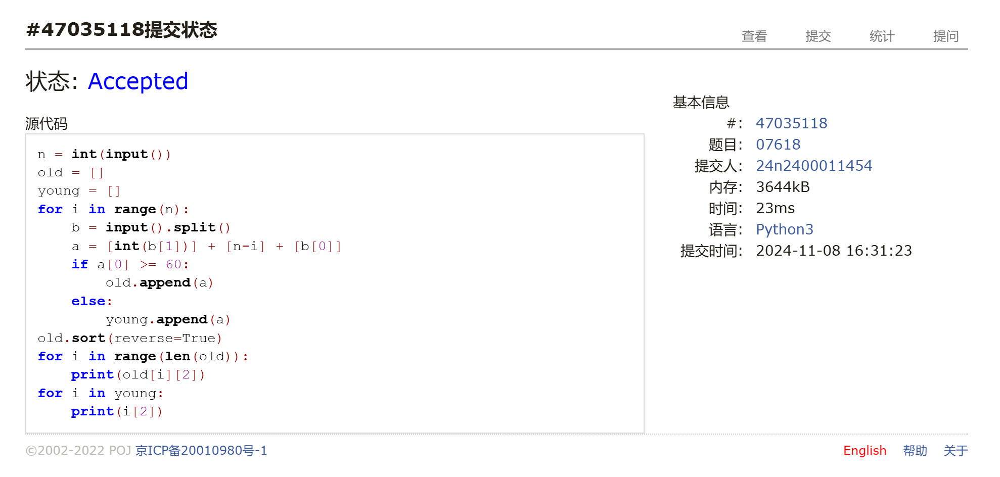
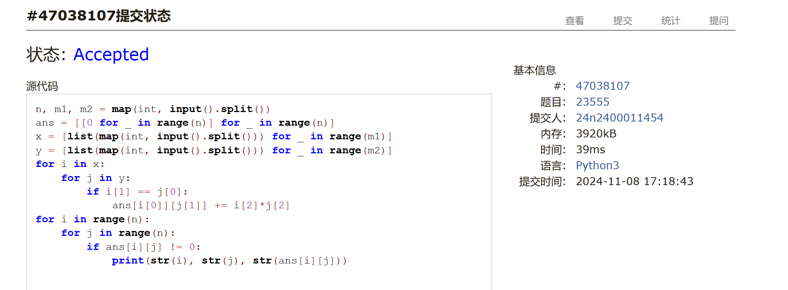
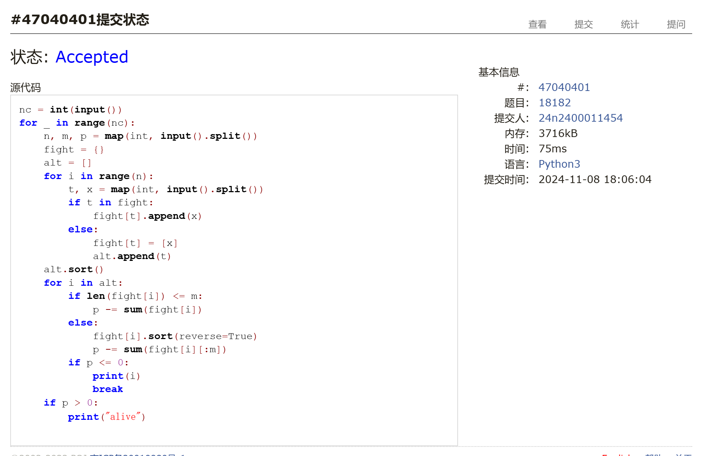
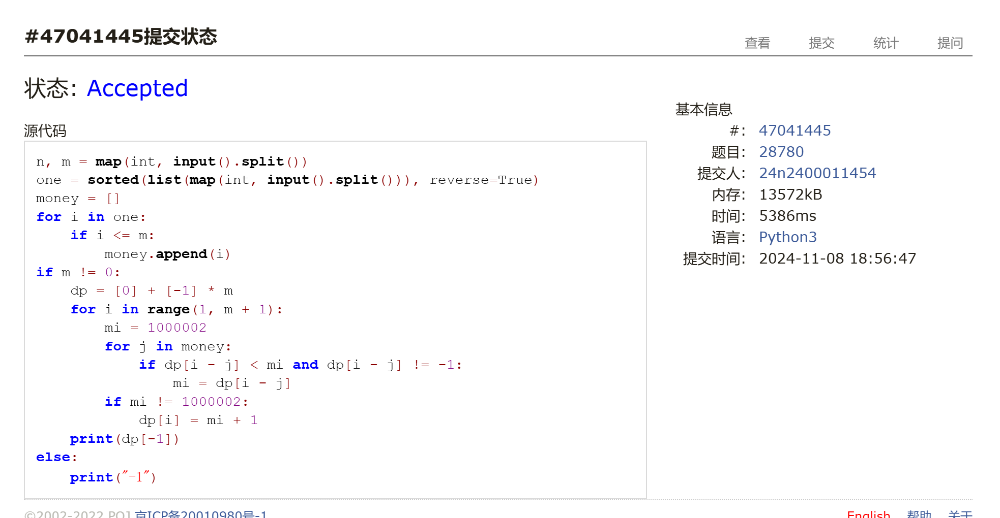
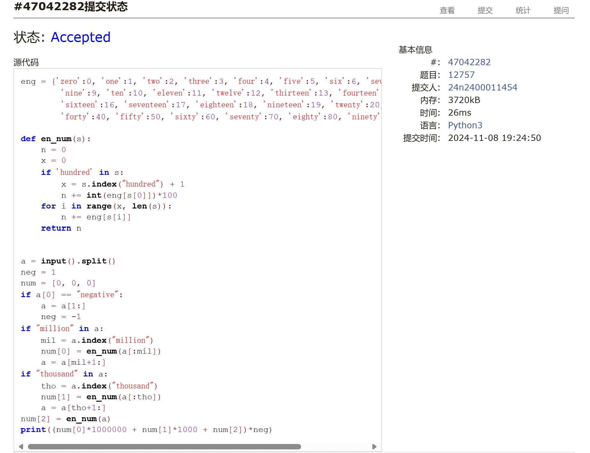
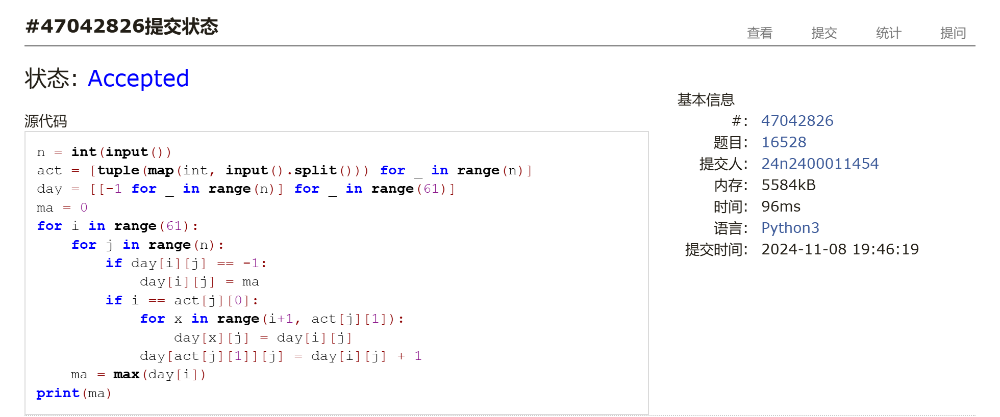

# Assignment #7: Nov Mock Exam立冬

Updated 1646 GMT+8 Nov 7, 2024

2024 fall, Complied by 金俊毅 物理学院


## 1. 题目

### E07618: 病人排队

sorttings, http://cs101.openjudge.cn/practice/07618/


代码：

```python
n = int(input())
old = []
young = []
for i in range(n):
    b = input().split()
    a = [int(b[1])] + [n-i] + [b[0]]
    if a[0] >= 60:
        old.append(a)
    else:
        young.append(a)
old.sort(reverse=True)
for i in range(len(old)):
    print(old[i][2])
for i in young:
    print(i[2])
```


代码运行截图 <mark>（至少包含有"Accepted"）</mark>



### E23555: 节省存储的矩阵乘法

implementation, matrices, http://cs101.openjudge.cn/practice/23555/

代码：

```python
n, m1, m2 = map(int, input().split())
ans = [[0 for _ in range(n)] for _ in range(n)]
x = [list(map(int, input().split())) for _ in range(m1)]
y = [list(map(int, input().split())) for _ in range(m2)]
for i in x:
    for j in y:
        if i[1] == j[0]:
            ans[i[0]][j[1]] += i[2]*j[2]
for i in range(n):
    for j in range(n):
        if ans[i][j] != 0:
            print(str(i), str(j), str(ans[i][j]))
```


代码运行截图 ==（至少包含有"Accepted"）==



### M18182: 打怪兽 

implementation/sortings/data structures, http://cs101.openjudge.cn/practice/18182/

代码：

```python
nc = int(input())
for _ in range(nc):
    n, m, p = map(int, input().split())
    fight = {}
    alt = []
    for i in range(n):
        t, x = map(int, input().split())
        if t in fight:
            fight[t].append(x)
        else:
            fight[t] = [x]
            alt.append(t)
    alt.sort()
    for i in alt:
        if len(fight[i]) <= m:
            p -= sum(fight[i])
        else:
            fight[i].sort(reverse=True)
            p -= sum(fight[i][:m])
        if p <= 0:
            print(i)
            break
    if p > 0:
        print("alive")
```


代码运行截图 <mark>（至少包含有"Accepted"）</mark>



### M28780: 零钱兑换3

dp, http://cs101.openjudge.cn/practice/28780/

代码：

```python
n, m = map(int, input().split())
one = sorted(list(map(int, input().split())), reverse=True)
money = []
for i in one:
    if i <= m:
        money.append(i)
if m != 0:
    dp = [0] + [-1] * m
    for i in range(1, m + 1):
        mi = 1000002
        for j in money:
            if dp[i - j] < mi and dp[i - j] != -1:
                mi = dp[i - j]
        if mi != 1000002:
            dp[i] = mi + 1
    print(dp[-1])
else:
    print("-1")
```


代码运行截图 <mark>（至少包含有"Accepted"）</mark>



### T12757: 阿尔法星人翻译官

implementation, http://cs101.openjudge.cn/practice/12757

代码：

```python
eng = {'zero':0, 'one':1, 'two':2, 'three':3, 'four':4, 'five':5, 'six':6, 'seven':7, 'eight':8,
        'nine':9, 'ten':10, 'eleven':11, 'twelve':12, 'thirteen':13, 'fourteen':14, 'fifteen':15,
        'sixteen':16, 'seventeen':17, 'eighteen':18, 'nineteen':19, 'twenty':20, 'thirty':30,
        'forty':40, 'fifty':50, 'sixty':60, 'seventy':70, 'eighty':80, 'ninety':90}

def en_num(s):
    n = 0
    x = 0
    if 'hundred' in s:
        x = s.index("hundred") + 1
        n += int(eng[s[0]])*100
    for i in range(x, len(s)):
        n += eng[s[i]]
    return n


a = input().split()
neg = 1
num = [0, 0, 0]
if a[0] == "negative":
    a = a[1:]
    neg = -1
if "million" in a:
    mil = a.index("million")
    num[0] = en_num(a[:mil])
    a = a[mil+1:]
if "thousand" in a:
    tho = a.index("thousand")
    num[1] = en_num(a[:tho])
    a = a[tho+1:]
num[2] = en_num(a)
print((num[0]*1000000 + num[1]*1000 + num[2])*neg)
```


代码运行截图 <mark>（至少包含有"Accepted"）</mark>



### T16528: 充实的寒假生活

greedy/dp, cs10117 Final Exam, http://cs101.openjudge.cn/practice/16528/

代码：

```python
n = int(input())
act = [tuple(map(int, input().split())) for _ in range(n)]
day = [[-1 for _ in range(n)] for _ in range(61)]
ma = 0
for i in range(61):
    for j in range(n):
        if day[i][j] == -1:
            day[i][j] = ma
        if i == act[j][0]:
            for x in range(i+1, act[j][1]):
                day[x][j] = day[i][j]
            day[act[j][1]][j] = day[i][j] + 1
    ma = max(day[i])
print(ma)
```


代码运行截图 <mark>（至少包含有"Accepted"）</mark>



## 2. 学习总结和收获

看了一点dp的题目，但不多，期中投入时间过少，收获相应变少。

这次作业在思路上没有难度，期中事多没有参加月考，自己计时应该在规定时间可以做完，但好像看群里说自己做和在机房差别比较大，争取下次参加月考。


