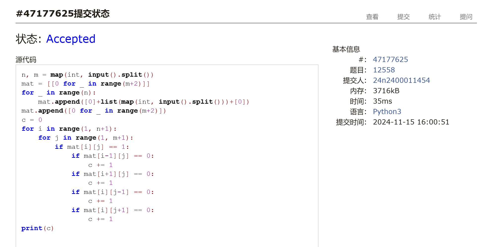
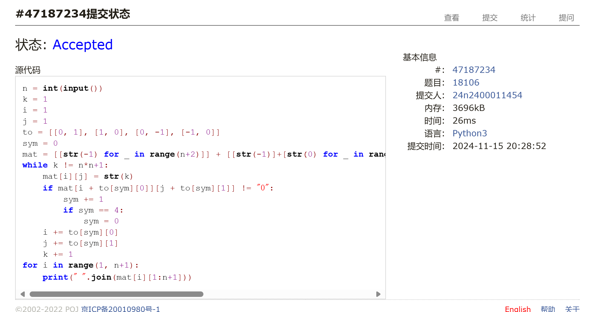
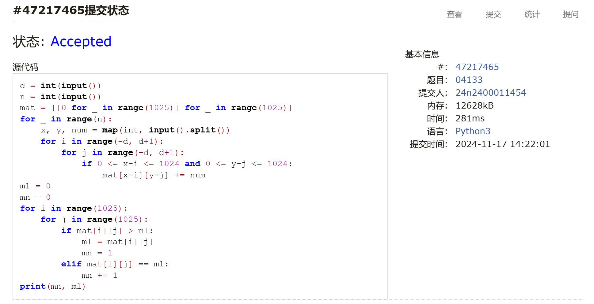
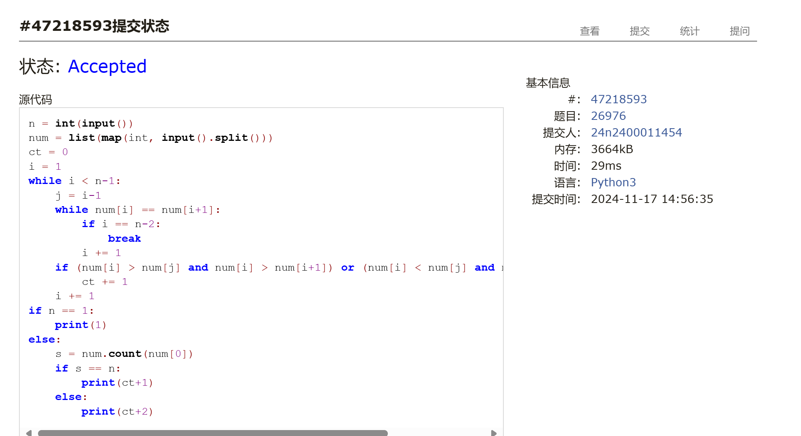
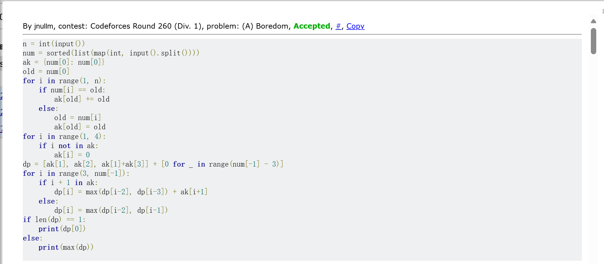
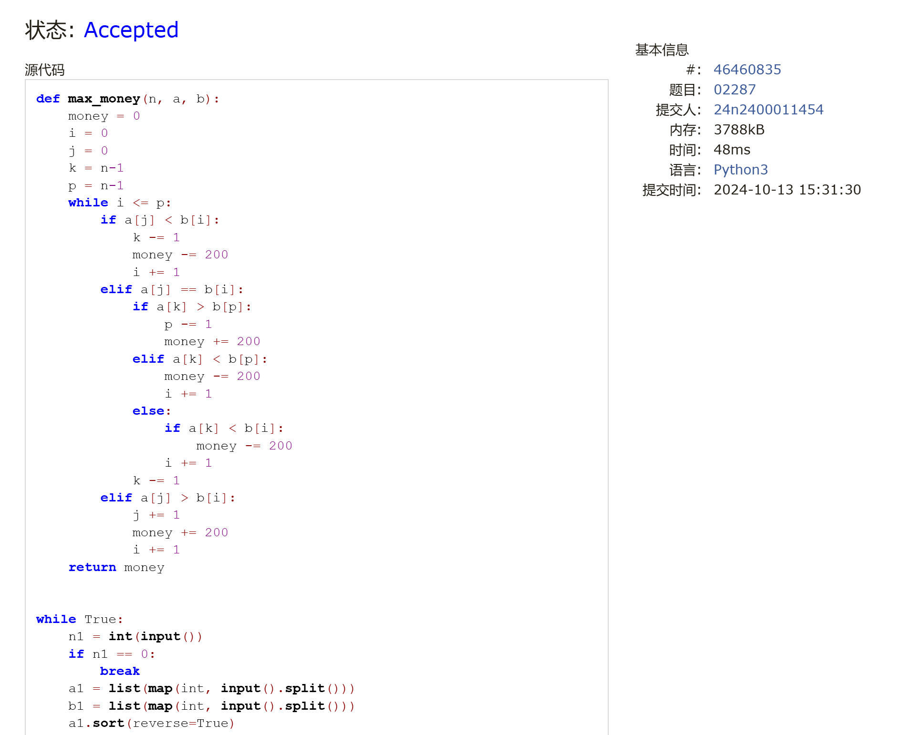

# Assignment #8: 田忌赛马来了

Updated 1021 GMT+8 Nov 12, 2024

2024 fall, Complied by 金俊毅，物理学院


## 1. 题目

### 12558: 岛屿周长

matices, http://cs101.openjudge.cn/practice/12558/ 


代码：

```python
n, m = map(int, input().split())
mat = [[0 for _ in range(m+2)]]
for _ in range(n):
    mat.append([0]+list(map(int, input().split()))+[0])
mat.append([0 for _ in range(m+2)])
c = 0
for i in range(1, n+1):
    for j in range(1, m+1):
        if mat[i][j] == 1:
            if mat[i-1][j] == 0:
                c += 1
            if mat[i+1][j] == 0:
                c += 1
            if mat[i][j-1] == 0:
                c += 1
            if mat[i][j+1] == 0:
                c += 1
print(c)
```
代码运行截图 <mark>（至少包含有"Accepted"）</mark>



### LeetCode54.螺旋矩阵

matrice, https://leetcode.cn/problems/spiral-matrix/

与OJ这个题目一样的 18106: 螺旋矩阵，http://cs101.openjudge.cn/practice/18106


代码：

```python
n = int(input())
k = 1
i = 1
j = 1
to = [[0, 1], [1, 0], [0, -1], [-1, 0]]
sym = 0
mat = [[str(-1) for _ in range(n+2)]] + [[str(-1)]+[str(0) for _ in range(n)]+[str(-1)] for _ in range(n)] + [[str(-1) for _ in range(n+2)]]
while k != n*n+1:
    mat[i][j] = str(k)
    if mat[i + to[sym][0]][j + to[sym][1]] != "0":
        sym += 1
        if sym == 4:
            sym = 0
    i += to[sym][0]
    j += to[sym][1]
    k += 1
for i in range(1, n+1):
    print(" ".join(mat[i][1:n+1]))
```


代码运行截图 ==（至少包含有"Accepted"）==



### 04133:垃圾炸弹

matrices, http://cs101.openjudge.cn/practice/04133/

代码：

```python
d = int(input())
n = int(input())
mat = [[0 for _ in range(1025)] for _ in range(1025)]
for _ in range(n):
    x, y, num = map(int, input().split())
    for i in range(-d, d+1):
        for j in range(-d, d+1):
            if 0 <= x-i <= 1024 and 0 <= y-j <= 1024:
                mat[x-i][y-j] += num
ml = 0
mn = 0
for i in range(1025):
    for j in range(1025):
        if mat[i][j] > ml:
            ml = mat[i][j]
            mn = 1
        elif mat[i][j] == ml:
            mn += 1
print(mn, ml)
```


代码运行截图 <mark>（至少包含有"Accepted"）</mark>



### LeetCode376.摆动序列

greedy, dp, https://leetcode.cn/problems/wiggle-subsequence/

与OJ这个题目一样的，26976:摆动序列, http://cs101.openjudge.cn/routine/26976/

代码：

```python
n = int(input())
num = list(map(int, input().split()))
ct = 0
i = 1
while i < n-1:
    j = i-1
    while num[i] == num[i+1]:
        if i == n-2:
            break
        i += 1
    if (num[i] > num[j] and num[i] > num[i+1]) or (num[i] < num[j] and num[i] < num[i+1]):
        ct += 1
    i += 1
if n == 1:
    print(1)
else:
    s = num.count(num[0])
    if s == n:
        print(ct+1)
    else:
        print(ct+2)
```


代码运行截图 <mark>（至少包含有"Accepted"）</mark>



### CF455A: Boredom

dp, 1500, https://codeforces.com/contest/455/problem/A

代码：

```python
n = int(input())
num = sorted(list(map(int, input().split())))
ak = {num[0]: num[0]}
old = num[0]
for i in range(1, n):
    if num[i] == old:
        ak[old] += old
    else:
        old = num[i]
        ak[old] = old
for i in range(1, 4):
    if i not in ak:
        ak[i] = 0
dp = [ak[1], ak[2], ak[1]+ak[3]] + [0 for _ in range(num[-1] - 3)]
for i in range(3, num[-1]):
    if i + 1 in ak:
        dp[i] = max(dp[i-2], dp[i-3]) + ak[i+1]
    else:
        dp[i] = max(dp[i-2], dp[i-1])
if len(dp) == 1:
    print(dp[0])
else:
    print(max(dp))
```


代码运行截图 <mark>（至少包含有"Accepted"）</mark>



### 02287: Tian Ji -- The Horse Racing

greedy, dfs http://cs101.openjudge.cn/practice/02287

代码：

```python
def max_money(n, a, b):
    money = 0
    i = 0
    j = 0
    k = n-1
    p = n-1
    while i <= p:
        if a[j] < b[i]:
            k -= 1
            money -= 200
            i += 1
        elif a[j] == b[i]:
            if a[k] > b[p]:
                p -= 1
                money += 200
            elif a[k] < b[p]:
                money -= 200
                i += 1
            else:
                if a[k] < b[i]:
                    money -= 200
                i += 1
            k -= 1
        elif a[j] > b[i]:
            j += 1
            money += 200
            i += 1
    return money


while True:
    n1 = int(input())
    if n1 == 0:
        break
    a1 = list(map(int, input().split()))
    b1 = list(map(int, input().split()))
    a1.sort(reverse=True)
    b1.sort(reverse=True)
    print(max_money(n1, a1, b1))
```


代码运行截图 <mark>（至少包含有"Accepted"）</mark>



## 2. 学习总结和收获

随着dp题做的多了，对于dp题目的感觉慢慢上来了，不再是得想好久才想的出来了。接下来这一个月更要加大力度练习。


