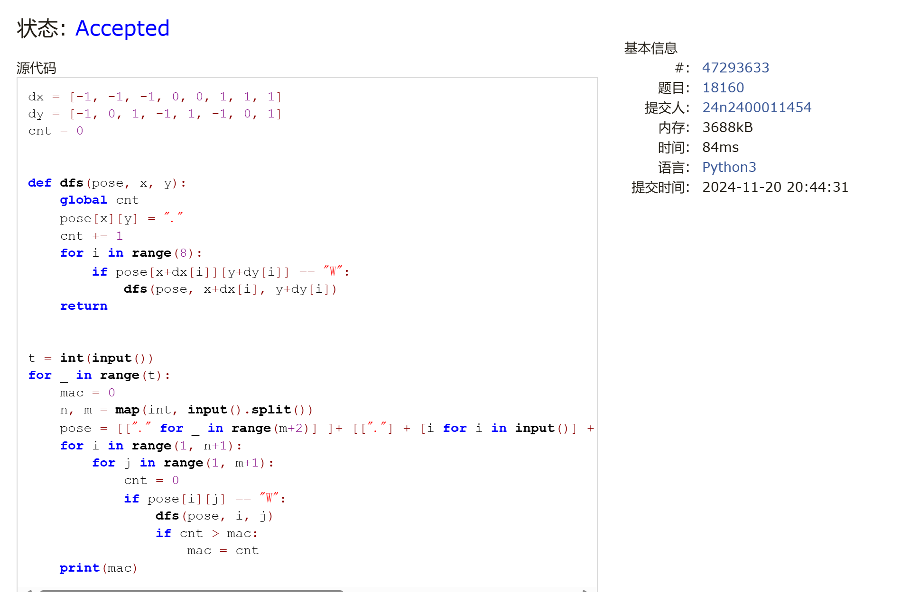
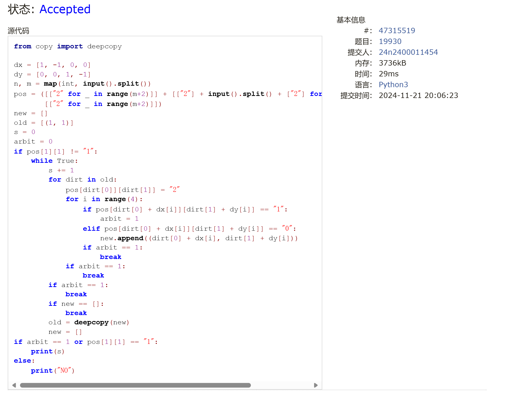
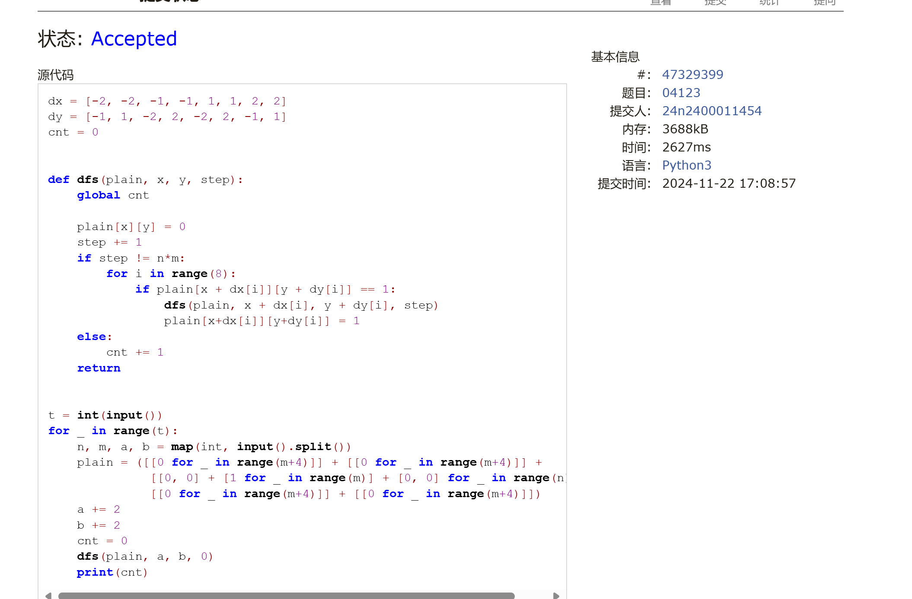
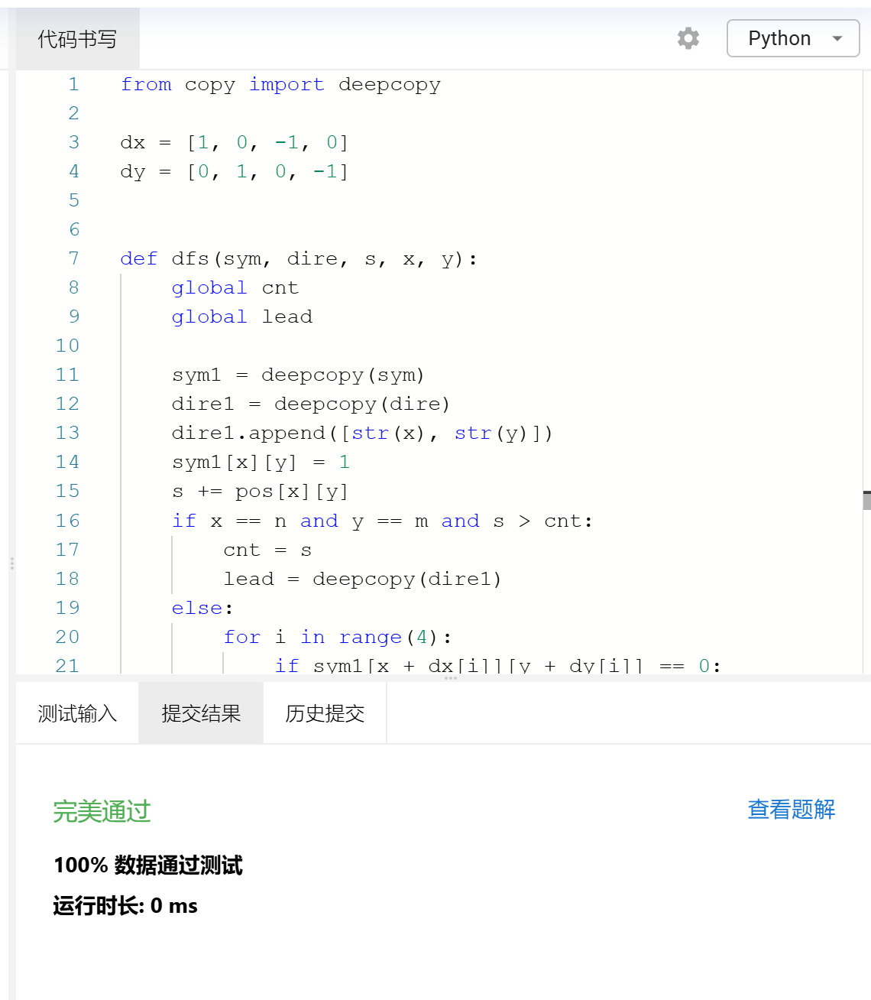
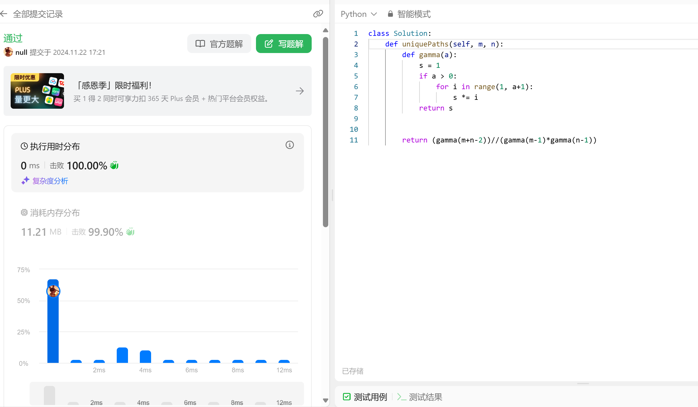
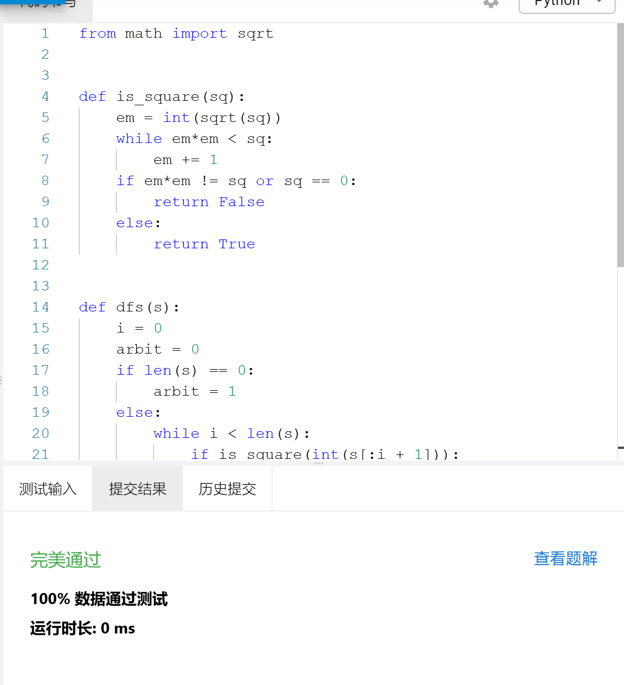

# Assignment #9: dfs, bfs, & dp

Updated 2107 GMT+8 Nov 19, 2024

2024 fall, Complied by 金俊毅，物理学院


**说明：**

1）请把每个题目解题思路（可选），源码Python, 或者C++（已经在Codeforces/Openjudge上AC），截图（包含Accepted），填写到下面作业模版中（推荐使用 typora https://typoraio.cn ，或者用word）。AC 或者没有AC，都请标上每个题目大致花费时间。

2）提交时候先提交pdf文件，再把md或者doc文件上传到右侧“作业评论”。Canvas需要有同学清晰头像、提交文件有pdf、"作业评论"区有上传的md或者doc附件。

3）如果不能在截止前提交作业，请写明原因。


## 1. 题目

### 18160: 最大连通域面积

dfs similar, http://cs101.openjudge.cn/practice/18160

代码：

```python
dx = [-1, -1, -1, 0, 0, 1, 1, 1]
dy = [-1, 0, 1, -1, 1, -1, 0, 1]
cnt = 0


def dfs(pose, x, y):
    global cnt
    pose[x][y] = "."
    cnt += 1
    for i in range(8):
        if pose[x+dx[i]][y+dy[i]] == "W":
            dfs(pose, x+dx[i], y+dy[i])
    return


t = int(input())
for _ in range(t):
    mac = 0
    n, m = map(int, input().split())
    pose = [["." for _ in range(m+2)] ]+ [["."] + [i for i in input()] + ["."] for _ in range(n)] + [["." for _ in range(m+2)]]
    for i in range(1, n+1):
        for j in range(1, m+1):
            cnt = 0
            if pose[i][j] == "W":
                dfs(pose, i, j)
                if cnt > mac:
                    mac = cnt
    print(mac)
```
代码运行截图 <mark>（至少包含有"Accepted"）</mark>



### 19930: 寻宝

bfs, http://cs101.openjudge.cn/practice/19930

代码：

```python
from copy import deepcopy

dx = [1, -1, 0, 0]
dy = [0, 0, 1, -1]
n, m = map(int, input().split())
pos = ([["2" for _ in range(m+2)]] + [["2"] + input().split() + ["2"] for _ in range(n)] +
       [["2" for _ in range(m+2)]])
new = []
old = [(1, 1)]
s = 0
arbit = 0
if pos[1][1] != "1":
    while True:
        s += 1
        for dirt in old:
            pos[dirt[0]][dirt[1]] = "2"
            for i in range(4):
                if pos[dirt[0] + dx[i]][dirt[1] + dy[i]] == "1":
                    arbit = 1
                elif pos[dirt[0] + dx[i]][dirt[1] + dy[i]] == "0":
                    new.append((dirt[0] + dx[i], dirt[1] + dy[i]))
                if arbit == 1:
                    break
            if arbit == 1:
                break
        if arbit == 1:
            break
        if new == []:
            break
        old = deepcopy(new)
        new = []
if arbit == 1 or pos[1][1] == "1":
    print(s)
else:
    print("NO")
```


代码运行截图 ==（至少包含有"Accepted"）==



### 04123: 马走日

dfs, http://cs101.openjudge.cn/practice/04123

代码：

```python
dx = [-2, -2, -1, -1, 1, 1, 2, 2]
dy = [-1, 1, -2, 2, -2, 2, -1, 1]
cnt = 0


def dfs(plain, x, y, step):
    global cnt

    plain[x][y] = 0
    step += 1
    if step != n*m:
        for i in range(8):
            if plain[x + dx[i]][y + dy[i]] == 1:
                dfs(plain, x + dx[i], y + dy[i], step)
                plain[x+dx[i]][y+dy[i]] = 1
    else:
        cnt += 1
    return


t = int(input())
for _ in range(t):
    n, m, a, b = map(int, input().split())
    plain = ([[0 for _ in range(m+4)]] + [[0 for _ in range(m+4)]] +
              [[0, 0] + [1 for _ in range(m)] + [0, 0] for _ in range(n)] +
              [[0 for _ in range(m+4)]] + [[0 for _ in range(m+4)]])
    a += 2
    b += 2
    cnt = 0
    dfs(plain, a, b, 0)
    print(cnt)
```


代码运行截图 <mark>（至少包含有"Accepted"）</mark>



### sy316: 矩阵最大权值路径

dfs, https://sunnywhy.com/sfbj/8/1/316

代码：

```python
from copy import deepcopy

dx = [1, 0, -1, 0]
dy = [0, 1, 0, -1]


def dfs(sym, dire, s, x, y):
    global cnt
    global lead

    sym1 = deepcopy(sym)
    dire1 = deepcopy(dire)
    dire1.append([str(x), str(y)])
    sym1[x][y] = 1
    s += pos[x][y]
    if x == n and y == m and s > cnt:
        cnt = s
        lead = deepcopy(dire1)
    else:
        for i in range(4):
            if sym1[x + dx[i]][y + dy[i]] == 0:
                dfs(sym1, dire1, s, x + dx[i], y + dy[i])
    return


cnt = -10000
n, m = map(int, input().split())
pos = ([[0 for _ in range(m+2)]] + [[0] + list(map(int, input().split())) + [0] for _ in range(n)]
       + [[0 for _ in range(m+2)]])
note = ([[1 for _ in range(m+2)]] + [[1] + [0 for _ in range(m)] + [1] for _ in range(n)]
        + [[1 for _ in range(m+2)]])
lead = []
dfs(note, [], 0, 1, 1)
for i in lead:
    print(" ".join(i))
```


代码运行截图 <mark>（至少包含有"Accepted"）</mark>



### LeetCode62.不同路径

dp, https://leetcode.cn/problems/unique-paths/

代码：

```python
class Solution:
    def uniquePaths(self, m, n):
        def gamma(a):
            s = 1
            if a > 0:
                for i in range(1, a+1):
                    s *= i
            return s


        return (gamma(m+n-2))//(gamma(m-1)*gamma(n-1))
```


代码运行截图 <mark>（至少包含有"Accepted"）</mark>



### sy358: 受到祝福的平方

dfs, dp, https://sunnywhy.com/sfbj/8/3/539

代码：

```python
from math import sqrt


def is_square(sq):
    em = int(sqrt(sq))
    while em*em < sq:
        em += 1
    if em*em != sq or sq == 0:
        return False
    else:
        return True


def dfs(s):
    i = 0
    arbit = 0
    if len(s) == 0:
        arbit = 1
    else:
        while i < len(s):
            if is_square(int(s[:i + 1])):
                if dfs(s[i + 1:]):
                    arbit = 1
            if arbit == 1:
                break
            i += 1
    if arbit == 1:
        return True
    else:
        return False


n = input()
if dfs(n):
    print("Yes")
else:
    print("No")
```


代码运行截图 <mark>（至少包含有"Accepted"）</mark>



## 2. 学习总结和收获

这次的作业主要让我重新熟悉了一下dfs和bfs，基本没有思路上的障碍。

就是在写马走日的时候，第一次写超时了，当时认为时间复杂度应该没问题，于是就开始思考细节，第一次用的是深拷贝当时的棋盘，发现这样数据量一上来可能就慢了，于是就改成了回溯，不再使用深拷贝，确实就过了（就这一题让我从周三卡到了周五）。

以及发现写题的时候视野不够开阔，比如写不同路径时，一开始就想到了组合，但是一扭头就去写每一种组合的具体情况，然后每种组合分开算，确实实现了，写完之后才突然意识到直接总体写一个组合数就行了。但这道题dp仍然是没有思路的，dp确实难，菜就多练。

每日选做日常跟进中。


