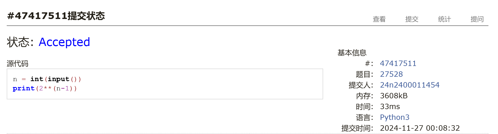
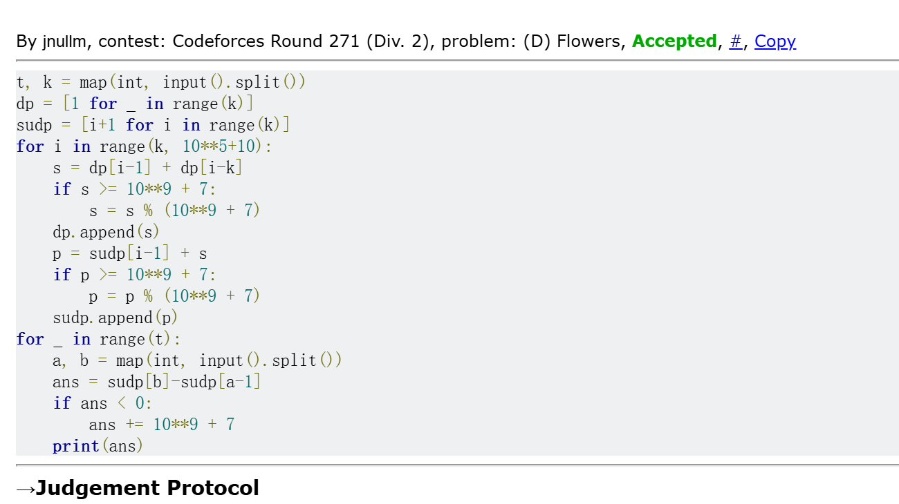
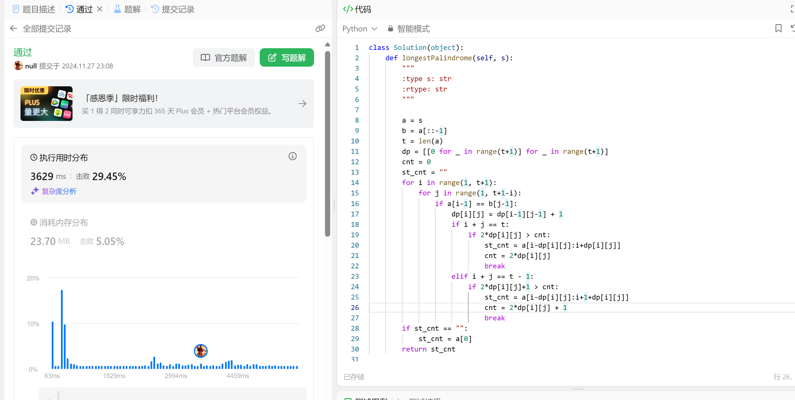
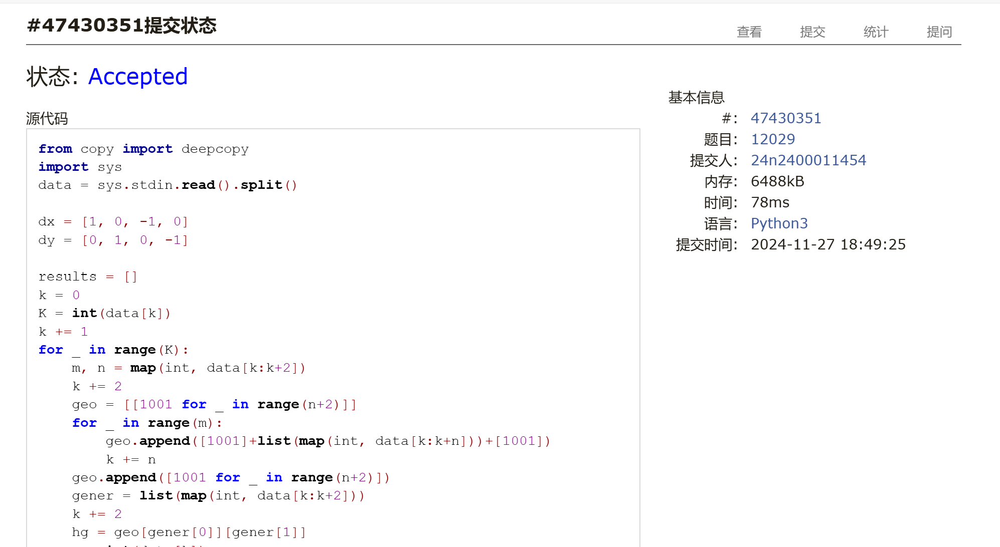
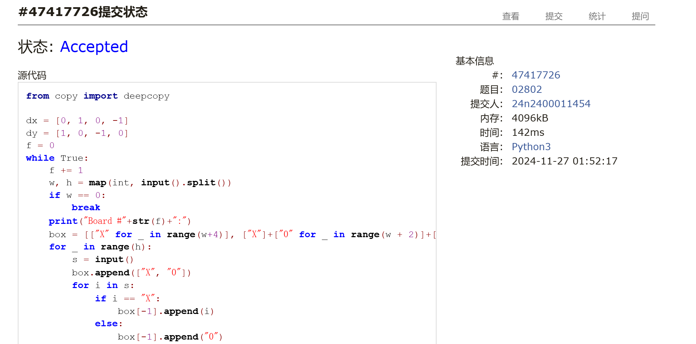

# Assignment #10: dp & bfs

Updated 2 GMT+8 Nov 25, 2024

2024 fall, Complied by 金俊毅，物理学院


## 1. 题目

### LuoguP1255 数楼梯

dp, bfs, https://www.luogu.com.cn/problem/P1255
代码：

```python
n = int(input())
dp = [1, 1] + [0 for _ in range(n-1)]
for i in range(2, n+1):
    dp[i] = dp[i-1] + dp[i-2]
print(dp[-1])
```


代码运行截图 <mark>（至少包含有"Accepted"）</mark>


### 27528: 跳台阶

dp, http://cs101.openjudge.cn/practice/27528/
代码：

```python
n = int(input())
print(2**(n-1))
```


代码运行截图 ==（至少包含有"Accepted"）==



### 474D. Flowers

dp, https://codeforces.com/problemset/problem/474/D

代码：

```python
t, k = map(int, input().split())
dp = [1 for _ in range(k)]
sudp = [i+1 for i in range(k)]
for i in range(k, 10**5+10):
    s = dp[i-1] + dp[i-k]
    if s >= 10**9 + 7:
        s = s % (10**9 + 7)
    dp.append(s)
    p = sudp[i-1] + s
    if p >= 10**9 + 7:
        p = p % (10**9 + 7)
    sudp.append(p)
for _ in range(t):
    a, b = map(int, input().split())
    ans = sudp[b]-sudp[a-1]
    if ans < 0:
        ans += 10**9 + 7
    print(ans)

```


代码运行截图 <mark>（至少包含有"Accepted"）</mark>



### LeetCode5.最长回文子串

dp, two pointers, string, https://leetcode.cn/problems/longest-palindromic-substring/

代码：

```python
class Solution(object):
    def longestPalindrome(self, s):
        """
        :type s: str
        :rtype: str
        """
        
        a = s
        b = a[::-1]
        t = len(a)
        dp = [[0 for _ in range(t+1)] for _ in range(t+1)]
        cnt = 0
        st_cnt = ""
        for i in range(1, t+1):
            for j in range(1, t+1-i):
                if a[i-1] == b[j-1]:
                    dp[i][j] = dp[i-1][j-1] + 1
                    if i + j == t:
                        if 2*dp[i][j] > cnt:
                            st_cnt = a[i-dp[i][j]:i+dp[i][j]]
                            cnt = 2*dp[i][j]
                            break
                    elif i + j == t - 1:
                        if 2*dp[i][j]+1 > cnt:
                            st_cnt = a[i-dp[i][j]:i+1+dp[i][j]]
                            cnt = 2*dp[i][j] + 1
                            break
        if st_cnt == "":
            st_cnt = a[0]
        return st_cnt
```


代码运行截图 <mark>（至少包含有"Accepted"）</mark>



### 12029: 水淹七军

bfs, dfs, http://cs101.openjudge.cn/practice/12029/

代码：

```python
from copy import deepcopy
import sys
data = sys.stdin.read().split()

dx = [1, 0, -1, 0]
dy = [0, 1, 0, -1]

results = []
k = 0
K = int(data[k])
k += 1
for _ in range(K):
    m, n = map(int, data[k:k+2])
    k += 2
    geo = [[1001 for _ in range(n+2)]]
    for _ in range(m):
        geo.append([1001]+list(map(int, data[k:k+n]))+[1001])
        k += n
    geo.append([1001 for _ in range(n+2)])
    gener = list(map(int, data[k:k+2]))
    k += 2
    hg = geo[gener[0]][gener[1]]
    p = int(data[k])
    k += 1
    water = []
    for _ in range(p):
        water.append(list(map(int, data[k:k+2])))
        k += 2

    arbit = 0
    for i in range(p):
        old = [water[i]]
        new = []
        while True:
            for now in old:
                for j in range(4):
                    if geo[now[0]+dx[j]][now[1]+dy[j]] < geo[now[0]][now[1]]:
                        geo[now[0] + dx[j]][now[1] + dy[j]] = geo[now[0]][now[1]]
                        if [now[0]+dx[j], now[1]+dy[j]] not in new:
                            new.append([now[0]+dx[j], now[1]+dy[j]])
                if geo[gener[0]][gener[1]] > hg:
                    arbit = 1
                    break
            if arbit == 1:
                break
            if new == []:
                break
            old = deepcopy(new)
            new = []
        if arbit == 1:
            break
    if arbit == 1:
        results.append("Yes")
    else:
        results.append("No")
sys.stdout.write("\n".join(results) + "\n")
```


代码运行截图 <mark>（至少包含有"Accepted"）</mark>



### 02802: 小游戏

bfs, http://cs101.openjudge.cn/practice/02802/

代码：

```python
from copy import deepcopy

dx = [0, 1, 0, -1]
dy = [1, 0, -1, 0]
f = 0
while True:
    f += 1
    w, h = map(int, input().split())
    if w == 0:
        break
    print("Board #"+str(f)+":")
    box = [["X" for _ in range(w+4)], ["X"]+["0" for _ in range(w + 2)]+["X"]]
    for _ in range(h):
        s = input()
        box.append(["X", "0"])
        for i in s:
            if i == "X":
                box[-1].append(i)
            else:
                box[-1].append("0")
        box[-1].append("0")
        box[-1].append("X")
    box.append(["X"]+["0" for _ in range(w + 2)]+["X"])
    box.append(["X" for _ in range(w+4)])
    s = 0
    while True:
        s += 1
        x1, y1, x2, y2 = map(int, input().split())
        x1 += 1
        y1 += 1
        x2 += 1
        y2 += 1
        if x1 == 1 and y1 == 1:
            break
        old = [[x1, y1, -1, 0]]
        new = []
        box1 = deepcopy(box)
        box1[y1][x1] = "X"
        arbit = 0
        mini_seg = (w+10)*(h+10)
        while True:
            for now in old:
                for i in range(4):
                    if now[0] + dx[i] == x2 and now[1] + dy[i] == y2:
                        if i != now[2]:
                            mini_seg = min(mini_seg, now[3]+1)
                        else:
                            mini_seg = min(mini_seg, now[3])
                        break
                    elif box1[now[1] + dy[i]][now[0] + dx[i]] == "0":
                        new.append([now[0] + dx[i], now[1] + dy[i], i, now[3]])
                        if i != now[2]:
                            new[-1][3] += 1
                        box1[now[1] + dy[i]][now[0] + dx[i]] = str(new[-1][3])
                    elif box1[now[1] + dy[i]][now[0] + dx[i]] != "X":
                        aa = now[3]
                        if i != now[2]:
                            aa += 1
                        if aa < int(box1[now[1] + dy[i]][now[0] + dx[i]]):
                            new.append([now[0] + dx[i], now[1] + dy[i], i, aa])
                            box1[now[1] + dy[i]][now[0] + dx[i]] = str(aa)
            if new == []:
                break
            old = deepcopy(new)
            new = deepcopy([])
        if mini_seg == (w+10)*(h+10):
            print("Pair "+str(s)+": impossible.")
        else:
            print("Pair "+str(s)+": "+str(mini_seg)+" segments.")
    print("")
```

代码运行截图 <mark>（至少包含有"Accepted"）</mark>



## 2. 学习总结和收获

作业题都比较容易有思路，就是第三题想了一小会。第四题朴素算法很好写，就是马拉车研究了半天。每日选做跟进中。


