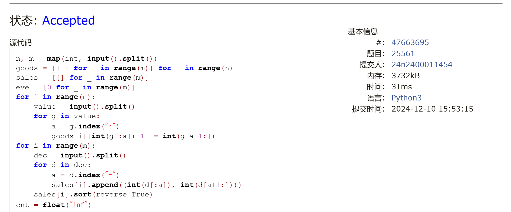

# Assignment #B: Dec Mock Exam大雪前一天

Updated 1649 GMT+8 Dec 5, 2024

2024 fall, Complied by 金俊毅，物理学院

## 1. 题目

### E22548: 机智的股民老张

http://cs101.openjudge.cn/practice/22548/

代码：

```python
money = list(map(int, input().split()))
a = len(money)
mi = money[0]
c = 0
for i in range(a):
    if money[i] < mi:
        mi = money[i]
    if money[i] - mi > c:
        c = money[i] - mi
print(c)
```

代码运行截图 <mark>（至少包含有"Accepted"）</mark>


### M28701: 炸鸡排

greedy, http://cs101.openjudge.cn/practice/28701/

代码：

```python
n, k = map(int, input().split())
chic = list(map(int, input().split()))
chic.sort(reverse=True)
b = sum(chic)
i = 0
while True:
    if chic[i] <= b/k:
        t = b/k
        break
    else:
        i += 1
        k -= 1
        b -= chic[i-1]
print("{:.3f}".format(t))
```


代码运行截图 ==（至少包含有"Accepted"）==


### M20744: 土豪购物

dp, http://cs101.openjudge.cn/practice/20744/

代码：

```python
value = list(map(int, input().split(",")))
a = len(value)
dp1 = [value[0]] + [0 for _ in range(a)]
dp2 = [value[0]] + [0 for _ in range(a)]
for i in range(1, a):
    dp1[i] = max(dp1[i-1]+value[i], value[i])
    dp2[i] = max(dp1[i-1], dp2[i-1]+value[i], value[i])
print(max(dp2))
```


代码运行截图 <mark>（至少包含有"Accepted"）</mark>


### T25561: 2022决战双十一

brute force, dfs, http://cs101.openjudge.cn/practice/25561/

代码：

```python
n, m = map(int, input().split())
goods = [[-1 for _ in range(m)] for _ in range(n)]
sales = [[] for _ in range(m)]
eve = [0 for _ in range(m)]
for i in range(n):
    value = input().split()
    for g in value:
        a = g.index(":")
        goods[i][int(g[:a])-1] = int(g[a+1:])
for i in range(m):
    dec = input().split()
    for d in dec:
        a = d.index("-")
        sales[i].append((int(d[:a]), int(d[a+1:])))
    sales[i].sort(reverse=True)
cnt = float("inf")


def dfs(s, step):
    global m
    global eve
    global cnt

    if step == n:
        s -= (s//300)*50
        bsu = 0
        for x in range(m):
            b = 0
            for sale in sales[x]:
                if eve[x] >= sale[0] and b < sale[1]:
                    b = sale[1]
            bsu += b
        s -= bsu
        if s < cnt:
            cnt = s
    else:
        for x in range(m):
            if step == 0:
                eve = [0 for _ in range(m)]
            if goods[step][x] != -1:
                s += goods[step][x]
                eve[x] += goods[step][x]
                dfs(s, step+1)
                s -= goods[step][x]
                eve[x] -= goods[step][x]


dfs(0, 0)
print(cnt)
```


代码运行截图 <mark>（至少包含有"Accepted"）</mark>



### T20741: 两座孤岛最短距离

dfs, bfs, http://cs101.openjudge.cn/practice/20741/

代码：

```python
from collections import deque
dx = [1, -1, 0, 0]
dy = [0, 0, 1, -1]
n = int(input())
pose = [[int(i) for i in input()] for _ in range(n)]
m = len(pose[0])
q = deque()


def dfs(x, y):
    pose[y][x] = 2
    q.append((x, y, 0))
    for i in range(4):
        nx1, ny1 = x+dx[i], y+dy[i]
        if 0 <= nx1 <= m-1 and 0 <= ny1 <= n-1:
            if pose[ny1][nx1] == 1:
                dfs(nx1, ny1)


judge = 0
for i in range(n):
    for j in range(m):
        if pose[i][j] == 1:
            judge = 1
            dfs(j, i)
            break
    if judge == 1:
        break

arbit = 0
while True:
    a, b, step = map(int, q.popleft())
    for i in range(4):
        nx, ny = a+dx[i], b+dy[i]
        if 0 <= nx <= m-1 and 0 <= ny <= n-1:
            if pose[ny][nx] == 1:
                arbit = 1
                print(step)
                break
            elif pose[ny][nx] == 0:
                pose[ny][nx] = -1
                q.append((nx, ny, step+1))
    if arbit == 1:
        break
```


代码运行截图 <mark>（至少包含有"Accepted"）</mark>


### T28776: 国王游戏

greedy, http://cs101.openjudge.cn/practice/28776

代码：

```python
n = int(input())
king = list(map(int, input().split()))
sev = []
for _ in range(n):
    b = list(map(int, input().split()))
    b = [b[0]*b[1]] + b
    sev.append(b)
sev.sort()
s = king[0]
cnt = 0
for i in range(n):
    s *= sev[i][1]
    a = s//sev[i][0]
    if a > cnt:
        cnt = a
print(cnt)
```


代码运行截图 <mark>（至少包含有"Accepted"）</mark>


## 2. 学习总结和收获

稍微反思了一下上次月考的经历，主要是被2，3两题耽误了，鸡排写了一个小时没写出来，导致后面三道题根本没看。考完自己做的时候反而两道搜索题没有任何障碍，看来下次机考不应该纯粹的按顺序做题。
dp和greedy还是没什么思路，这几天再多做一下相关题好了。


