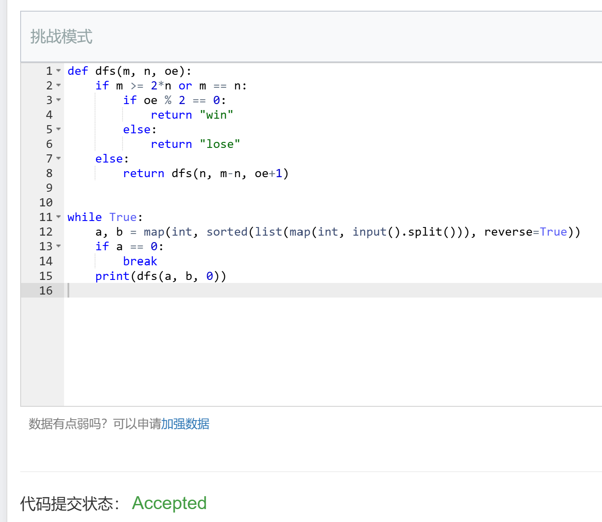
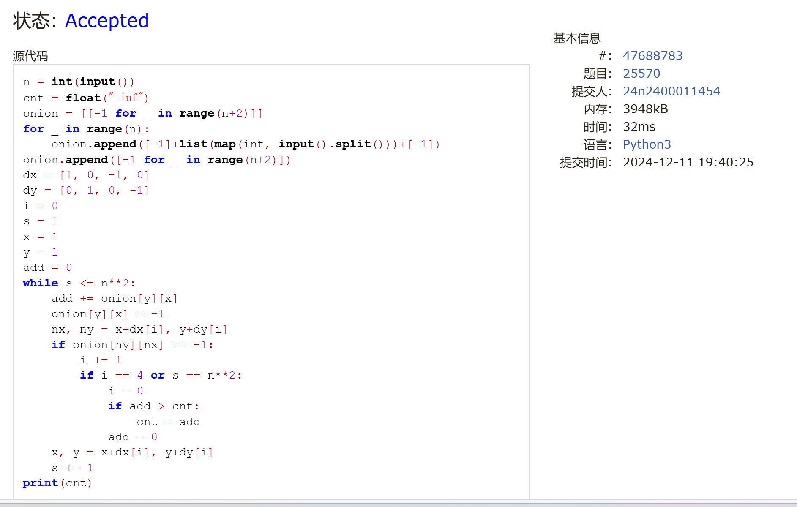
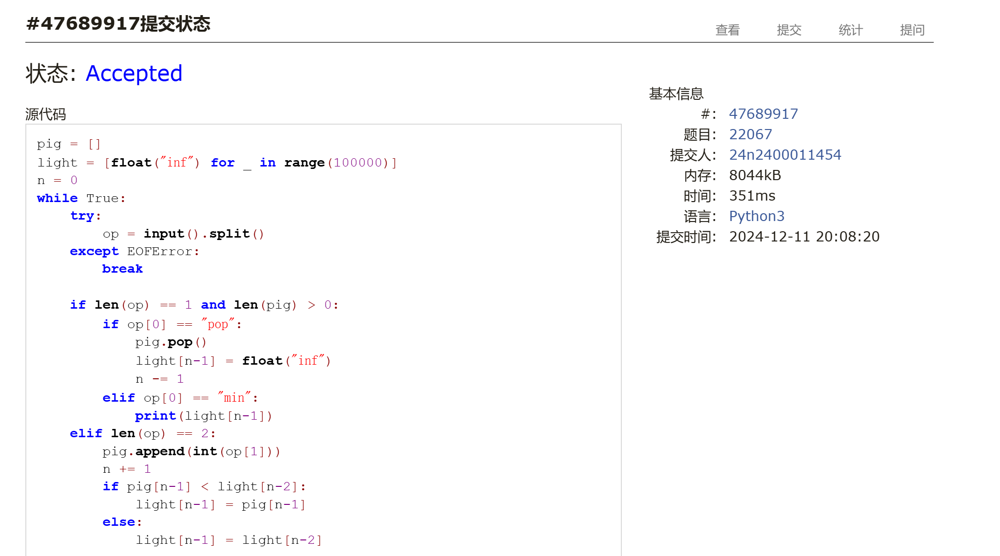
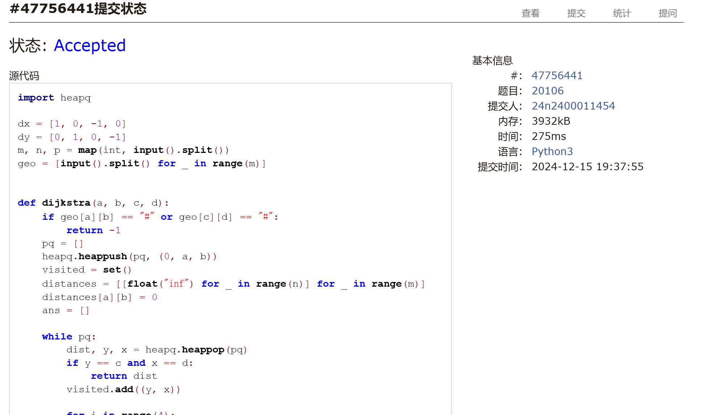
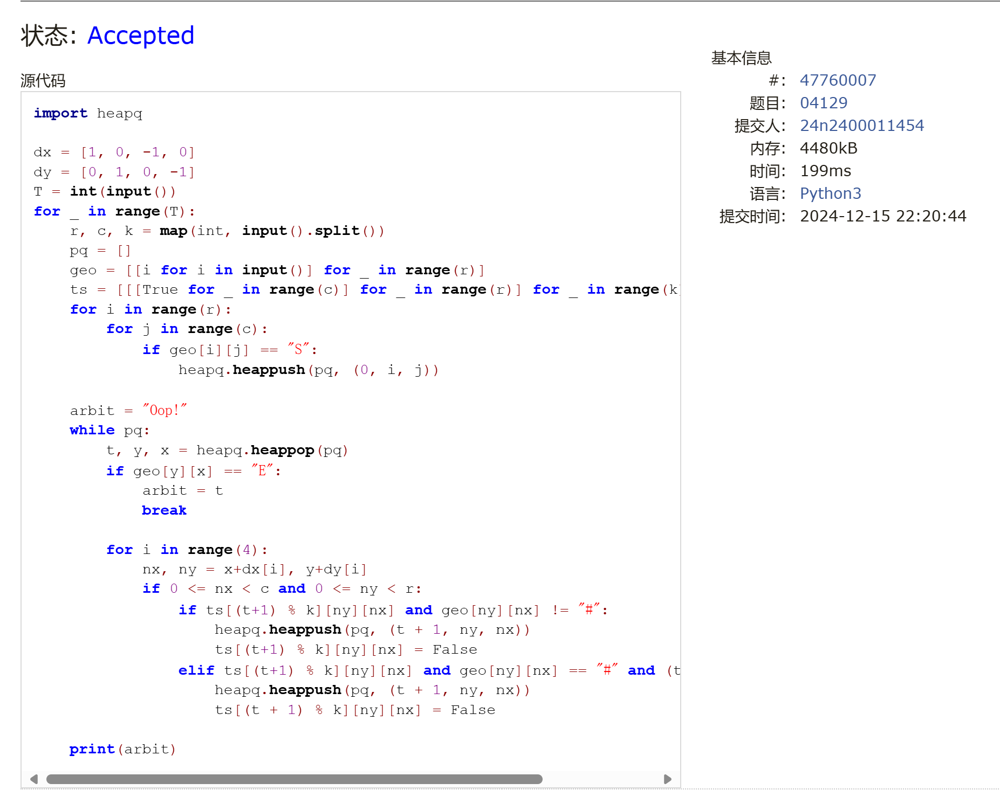

# Assignment #C: 五味杂陈 

Updated 1148 GMT+8 Dec 10, 2024

2024 fall, Complied by 金俊毅，物理学院


## 1. 题目

### 1115. 取石子游戏

dfs, https://www.acwing.com/problem/content/description/1117/

代码：

```python
def dfs(m, n, oe):
    if m >= 2*n or m == n:
        if oe % 2 == 0:
            return "win"
        else:
            return "lose"
    else:
        return dfs(n, m-n, oe+1)


while True:
    a, b = map(int, sorted(list(map(int, input().split())), reverse=True))
    if a == 0:
        break
    print(dfs(a, b, 0))

```


代码运行截图 <mark>（至少包含有"Accepted"）</mark>



### 25570: 洋葱

Matrices, http://cs101.openjudge.cn/practice/25570

代码：

```python
n = int(input())
cnt = float("-inf")
onion = [[-1 for _ in range(n+2)]]
for _ in range(n):
    onion.append([-1]+list(map(int, input().split()))+[-1])
onion.append([-1 for _ in range(n+2)])
dx = [1, 0, -1, 0]
dy = [0, 1, 0, -1]
i = 0
s = 1
x = 1
y = 1
add = 0
while s <= n**2:
    add += onion[y][x]
    onion[y][x] = -1
    nx, ny = x+dx[i], y+dy[i]
    if onion[ny][nx] == -1:
        i += 1
        if i == 4 or s == n**2:
            i = 0
            if add > cnt:
                cnt = add
            add = 0
    x, y = x+dx[i], y+dy[i]
    s += 1
print(cnt)
```


代码运行截图 ==（至少包含有"Accepted"）==



### 1526C1. Potions(Easy Version)

greedy, dp, data structures, brute force, *1500, https://codeforces.com/problemset/problem/1526/C1

思路：


代码：

```python
n = int(input())
pot = list(map(int, input().split()))
dp = [0] + [float("-inf") for _ in range(n)]
for i in range(n+1):
    for j in range(i, 0, -1):
        mid = max(dp[j], dp[j-1]+pot[i-1])
        if mid >= 0:
            dp[j] = mid
for i in range(n, -1, -1):
    if dp[i] >= 0:
        print(i)
        break
```


代码运行截图 <mark>（至少包含有"Accepted"）</mark>



### 22067: 快速堆猪

辅助栈，http://cs101.openjudge.cn/practice/22067/

代码：

```python
pig = []
light = [float("inf") for _ in range(100000)]
n = 0
while True:
    try:
        op = input().split()
    except EOFError:
        break

    if len(op) == 1 and len(pig) > 0:
        if op[0] == "pop":
            pig.pop()
            light[n-1] = float("inf")
            n -= 1
        elif op[0] == "min":
            print(light[n-1])
    elif len(op) == 2:
        pig.append(int(op[1]))
        n += 1
        if pig[n-1] < light[n-2]:
            light[n-1] = pig[n-1]
        else:
            light[n-1] = light[n-2]
```


代码运行截图 <mark>（至少包含有"Accepted"）</mark>


### 20106: 走山路

Dijkstra, http://cs101.openjudge.cn/practice/20106/

代码：

```python
import heapq

dx = [1, 0, -1, 0]
dy = [0, 1, 0, -1]
m, n, p = map(int, input().split())
geo = [input().split() for _ in range(m)]


def dijkstra(a, b, c, d):
    if geo[a][b] == "#" or geo[c][d] == "#":
        return -1
    pq = []
    heapq.heappush(pq, (0, a, b))
    visited = set()
    distances = [[float("inf") for _ in range(n)] for _ in range(m)]
    distances[a][b] = 0
    ans = []

    while pq:
        dist, y, x = heapq.heappop(pq)
        if y == c and x == d:
            return dist
        visited.add((y, x))

        for i in range(4):
            nx, ny = x+dx[i], y+dy[i]
            if 0 <= nx < n and 0 <= ny < m:
                if geo[ny][nx] != "#":
                    next_dist = dist + abs(int(geo[ny][nx])-int(geo[y][x]))
                    if next_dist < distances[ny][nx]:
                        distances[ny][nx] = next_dist
                        heapq.heappush(pq, (next_dist, ny, nx))
    return -1


for _ in range(p):
    a1, b1, c1, d1 = map(int, input().split())
    t = dijkstra(a1, b1, c1, d1)
    if t == -1:
        print("NO")
    else:
        print(t)
```


代码运行截图 <mark>（至少包含有"Accepted"）</mark>



### 04129: 变换的迷宫

bfs, http://cs101.openjudge.cn/practice/04129/

代码：

```python
import heapq

dx = [1, 0, -1, 0]
dy = [0, 1, 0, -1]
T = int(input())
for _ in range(T):
    r, c, k = map(int, input().split())
    pq = []
    geo = [[i for i in input()] for _ in range(r)]
    ts = [[[True for _ in range(c)] for _ in range(r)] for _ in range(k)]
    for i in range(r):
        for j in range(c):
            if geo[i][j] == "S":
                heapq.heappush(pq, (0, i, j))

    arbit = "Oop!"
    while pq:
        t, y, x = heapq.heappop(pq)
        if geo[y][x] == "E":
            arbit = t
            break

        for i in range(4):
            nx, ny = x+dx[i], y+dy[i]
            if 0 <= nx < c and 0 <= ny < r:
                if ts[(t+1) % k][ny][nx] and geo[ny][nx] != "#":
                    heapq.heappush(pq, (t + 1, ny, nx))
                    ts[(t+1) % k][ny][nx] = False
                elif ts[(t+1) % k][ny][nx] and geo[ny][nx] == "#" and (t + 1) % k == 0:
                    heapq.heappush(pq, (t + 1, ny, nx))
                    ts[(t + 1) % k][ny][nx] = False

    print(arbit)
```


代码运行截图 <mark>（至少包含有"Accepted"）</mark>



## 2. 学习总结和收获

学习了heapq的用法，周末写了两个整天，每日选做即将跟进到最新日期。


