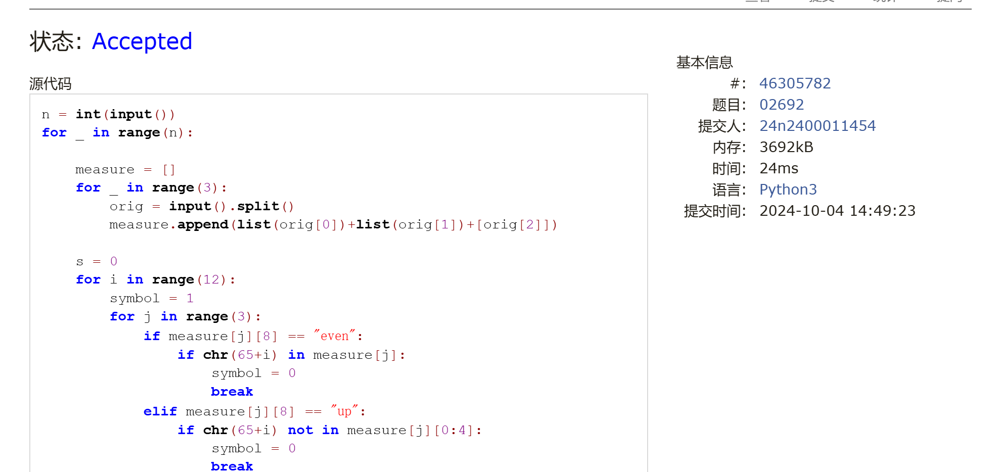

# Assignment #D: 十全十美 

Updated 1254 GMT+8 Dec 17, 2024

2024 fall, Complied by 金俊毅，物理学院

## 1. 题目

### 02692: 假币问题

brute force, http://cs101.openjudge.cn/practice/02692

代码：

```python
n = int(input())
for _ in range(n):

    measure = []
    for _ in range(3):
        orig = input().split()
        measure.append(list(orig[0])+list(orig[1])+[orig[2]])

    s = 0
    for i in range(12):
        symbol = 1
        for j in range(3):
            if measure[j][8] == "even":
                if chr(65+i) in measure[j]:
                    symbol = 0
                    break
            elif measure[j][8] == "up":
                if chr(65+i) not in measure[j][0:4]:
                    symbol = 0
                    break
            else:
                if chr(65+i) not in measure[j][4:8]:
                    symbol = 0
                    break
        if symbol == 1:
            s = 1
            fake = [i, 1]
            break

    if s == 0:
        for i in range(12):
            symbol = 1
            for j in range(3):
                if measure[j][8] == "even":
                    if chr(65 + i) in measure[j]:
                        symbol = 0
                        break
                elif measure[j][8] == "up":
                    if chr(65 + i) not in measure[j][4:8]:
                        symbol = 0
                        break
                else:
                    if chr(65 + i) not in measure[j][0:4]:
                        symbol = 0
                        break
            if symbol == 1:
                fake = [i, -1]
                break

    if fake[1] == 1:
        print(chr(fake[0]+65)+" is the counterfeit coin and it is heavy.")
    else:
        print(chr(fake[0]+65)+" is the counterfeit coin and it is light.")
```


代码运行截图 <mark>（至少包含有"Accepted"）</mark>



### 01088: 滑雪

dp, dfs similar, http://cs101.openjudge.cn/practice/01088

代码：

```python
import heapq

dx = [0, 0, 1, -1]
dy = [1, -1, 0, 0]
r, c = map(int, input().split())
mount = [list(map(int, input().split())) for _ in range(r)]
dp = [[1 for _ in range(c)] for _ in range(r)]
pq = []
cnt = 1

for i in range(r):
    for j in range(c):
        heapq.heappush(pq, (mount[i][j], j, i))

while pq:
    h, x, y = heapq.heappop(pq)
    for i in range(4):
        nx, ny = x+dx[i], y+dy[i]
        if 0 <= nx < c and 0 <= ny < r:
            if mount[ny][nx] > h and dp[y][x]+1 > dp[ny][nx]:
                dp[ny][nx] = dp[y][x]+1
                cnt = max(cnt, dp[ny][nx])

print(cnt)
```


代码运行截图 ==（至少包含有"Accepted"）==


### 25572: 螃蟹采蘑菇

bfs, dfs, http://cs101.openjudge.cn/practice/25572/

代码：

```python
dx = [1, -1, 0, 0]
dy = [0, 0, 1, -1]
n = int(input())
pos = [list(map(int, input().split())) for _ in range(n)]
visited = [[0 for _ in range(n)] for _ in range(n)]
dire = -1
for s in range(n):
    for j in range(n):
        if pos[s][j] == 5:
            xs, ys = j, s
            visited[ys][xs] = 1
            for k in range(4):
                if 0 <= xs + dx[k] <= n-1 and 0 <= ys + dy[k] <= n-1:
                    if pos[ys + dy[k]][xs + dx[k]] == 5:
                        dire = k
                        break
        if dire != -1:
            break
    if dire != -1:
        break


def dfs(x, y):
    global dire

    if pos[y][x] == 9 or pos[y + dy[dire]][x + dx[dire]] == 9:
        return True

    visited[y][x] = 1
    for i in range(4):
        nx, ny = x + dx[i], y + dy[i]
        if 0 <= nx <= n - 1 and 0 <= ny <= n - 1 and 0 <= nx + dx[dire] <= n - 1 and 0 <= ny + dy[dire] <= n - 1:
            if pos[ny][nx] != 1 and pos[ny + dy[dire]][nx + dx[dire]] != 1 and visited[ny][nx] == 0:
                if dfs(nx, ny):
                    return True

    return False


if dfs(xs, ys):
    print("yes")
else:
    print("no")
```


代码运行截图 <mark>（至少包含有"Accepted"）</mark>


### 27373: 最大整数

dp, http://cs101.openjudge.cn/practice/27373/

代码：

```python
m = int(input())
n = int(input())
number = input().split()
for i in range(n):
    for j in range(n-i-1):
        if number[j]+number[j+1] < number[j+1]+number[j]:
            number[j], number[j+1] = number[j+1], number[j]

dp = [["" for _ in range(m+1)] for _ in range(n+1)]
cnt = 0
mst = ""
for i in range(n):
    le = len(number[i])
    for j in range(m+1):
        if j >= le:
            if j == le and number[i] > dp[i][j]:
                dp[i+1][j] = number[i]
            elif dp[i][j-le] != "" and dp[i][j-le]+number[i] > dp[i][j]:
                dp[i+1][j] = dp[i][j-le]+number[i]
        if dp[i+1][j] == "":
            dp[i+1][j] = dp[i][j]

for i in range(m,-1,-1):
    if dp[-1][i] != "":
        print(dp[-1][i])
        break
```


代码运行截图 <mark>（至少包含有"Accepted"）</mark>


### 02811: 熄灯问题

brute force, http://cs101.openjudge.cn/practice/02811

代码：

```python
lamp = [list(map(int, input().split())) for _ in range(5)]
button = [[0 for _ in range(6)] for _ in range(5)]
arbit = 0
for b0 in range(2):
    button[0][0] = b0
    for b1 in range(2):
        button[0][1] = b1
        for b2 in range(2):
            button[0][2] = b2
            for b3 in range(2):
                button[0][3] = b3
                for b4 in range(2):
                    button[0][4] = b4
                    for b5 in range(2):
                        button[0][5] = b5

                        arbit = 0
                        for i in range(1, 5):
                            for j in range(6):
                                a = lamp[i-1][j] + button[i-1][j]
                                if j >= 1:
                                    a += button[i-1][j-1]
                                if j <= 4:
                                    a += button[i-1][j+1]
                                if i >= 2:
                                    a += button[i-2][j]
                                button[i][j] = a % 2

                        for j in range(6):
                            a = lamp[4][j] + button[4][j] + button[3][j]
                            if j >= 1:
                                a += button[4][j - 1]
                            if j <= 4:
                                a += button[4][j + 1]
                            if a % 2 != 0:
                                arbit = 1
                                break

                        if arbit == 0:
                            break
                    if arbit == 0:
                        break
                if arbit == 0:
                    break
            if arbit == 0:
                break
        if arbit == 0:
            break
    if arbit == 0:
        break
for i in range(5):
    for j in range(6):
        print(str(button[i][j]), end=" ")
    print("")
```


代码运行截图 <mark>（至少包含有"Accepted"）</mark>


### 08210: 河中跳房子

binary search, greedy, http://cs101.openjudge.cn/practice/08210/

代码：

```python
l, n, m = map(int, input().split())
stone = [0]+[int(input()) for _ in range(n)]+[l]
left = 0
right = l+1


def arb(s):
    global n
    global m

    x = stone[0]
    num = 0
    for i in range(1, n+2):
        if stone[i]-x < s:
            num += 1
        else:
            x = stone[i]

    if num > m:
        return True
    else:
        return False


while left != right-1:
    mid = (left+right)//2
    if arb(mid):
        right = mid
    else:
        left = mid

if right == mid:
    print(mid-1)
else:
    print(mid)
```


代码运行截图 <mark>（至少包含有"Accepted"）</mark>


## 2. 学习总结和收获

每日选做的一些难题这一周仍然是没有写出来的，还差几题，上机前估计赶不上了，明天直接看答案学个思路好了。
希望上机考试可以正常发挥，这个学期计概实在太充实了！


