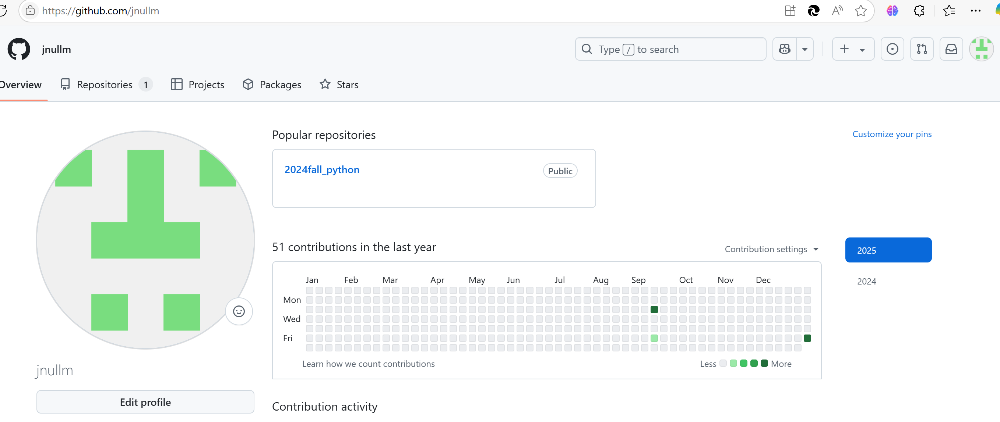

# Assignment #P: 课程大作业

Updated 1818 GMT+8 Jan 10, 2025

2024 fall, Complied by ==金俊毅，物理学院==

**说明：**

关乎每位同学维护自己的 GitHub 作业，本意是让大家练习常用于计算机科学学生的代码和文档维护方法。通过计算机相关课程，我们希望引导大家进入计算机学科领域。这将帮助同学们熟悉实际的编码和文档管理流程，并培养在团队协作和版本控制方面的技能。

1）提交内容，请填写到下面作业模版中。

2）截止时间是期末出分前，因为Canvas可以多次提交，建议期末机考前提交一次，考试后加上课程总结再提交一次。

提交时候先提交pdf文件，再把md或者doc文件上传到右侧“作业评论”。

评分标准

| 标准           | 等级                                   | 得分       |
| -------------- | -------------------------------------- | ---------- |
| 按时提交       | 1 得分提交，0.5 得分请假，0 得分未提交 | 1 分       |
| 你的GitHub网址 | 1 得分有，0 得分无                     | 1 分       |
| 你的GitHub截图 | 1 得分有，0 得分无                     | 1 分       |
| Cheatsheet     | 1 得分有，0 得分无                     | 1 分       |
| 课程资料和情报 | 1 得分有，0 得分无                     | 1 分       |
| 总得分：       |                                        | 5 ，满分 5 |

## 1. 提交内容

GitHub网址：https://github.com/jnullm

cheatsheet和课程资料与情报放在了github上了

## 2. 课程总结

这门课的内容实在是非常充实，实际上课程任务量并不算大，但如果加上每日选做的话任务量就会急增，于是到机考我也只是做完了openjudge上的每日选做，其他网站在11月布置的每日选做基本是没空去做的。

同时，在课程学习中，闫老师会布置远超这门课难度的内容（远超其他所有计概B的班级），导致会让人非常有去学的欲望。本人也没有对应的python基础，只是高一信息技术课的时候掌握了一点微量的语法，于是就会在学习的时候感到折磨，这算法怎么这么难啊，甚至在临近机考时跟别的python班的考试难度一对比，都隐隐感到了一丝绝望，比如在机考前我给自己定的AC目标是保4争5，结果机考时发现并不难，一路AC了下来，做满6道，这倒是挺意外的，最后一道T也是模板，感觉难度跟M差不了多少。

再说平时上课，其实除了头几节课坐在上课教室里敲码，其余的课我都没去上，主要是自己在看老师推荐的算法书学习（也就头一个月），之后都只是在写每周作业和每日选做，看一下老师发的讲义，仅此而已了。不去上课的原因主要是我个人契合不来老师在上面讲代码，我在下面听的这种感觉，觉得效率对我而言似乎有点低。事实证明，仅凭自己学效果其实也差不多。所以个人认为这门课主要还是在于跟着老师布置的任务自己去琢磨对应的知识。

基于上文，这门课值得强烈推荐。但计概作为必修课，到底有没有选上闫老师的课倒无关紧要，其实一样可以在闫老师的课程群中跟着这个班布置的作业和每日选做来学（如果是C的班那另说），效果没啥区别，再一次强推！

